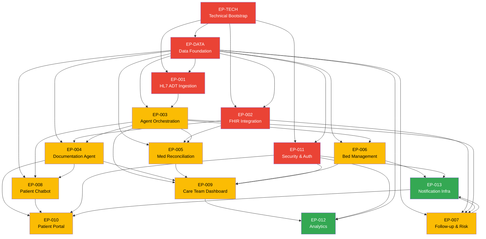

# SmartHandoff — Epic Backlog

> **Artifact:** epics | **Version:** 1.0 | **Status:** Draft
> **Date:** 2026-07-13 | **Upstream:** SRS v1.0, Design v1.0, Model v1.0 | **Workflow:** /create-epics
> **Product Manager:** SmartHandoff Project Team
> **ID Scheme:** EP-TECH · EP-DATA · EP-001 through EP-013

---

## Table of Contents

1. [Epic Summary & Delivery Order](#1-epic-summary--delivery-order)
2. [EP-TECH — Technical Bootstrap & Infrastructure](#2-ep-tech--technical-bootstrap--infrastructure)
3. [EP-DATA — Data Foundation & Schema](#3-ep-data--data-foundation--schema)
4. [EP-001 — HL7 ADT Event Ingestion](#4-ep-001--hl7-adt-event-ingestion)
5. [EP-002 — EHR / FHIR Integration](#5-ep-002--ehr--fhir-integration)
6. [EP-003 — AI Agent Orchestration Framework](#6-ep-003--ai-agent-orchestration-framework)
7. [EP-004 — Documentation Agent](#7-ep-004--documentation-agent)
8. [EP-005 — Medication Reconciliation Agent](#8-ep-005--medication-reconciliation-agent)
9. [EP-006 — Bed Management Agent](#9-ep-006--bed-management-agent)
10. [EP-007 — Follow-up Care Agent & Risk Scoring](#10-ep-007--follow-up-care-agent--risk-scoring)
11. [EP-008 — Patient Communication Agent & Chatbot](#11-ep-008--patient-communication-agent--chatbot)
12. [EP-009 — Care Team Dashboard & Real-Time Updates](#12-ep-009--care-team-dashboard--real-time-updates)
13. [EP-010 — Patient Portal](#13-ep-010--patient-portal)
14. [EP-011 — Security, Auth & HIPAA Compliance](#14-ep-011--security-auth--hipaa-compliance)
15. [EP-012 — Analytics & KPI Reporting](#15-ep-012--analytics--kpi-reporting)
16. [EP-013 — Notification & Communication Infrastructure](#16-ep-013--notification--communication-infrastructure)
17. [Epic Dependency Map](#17-epic-dependency-map)
18. [Requirement Coverage Matrix](#18-requirement-coverage-matrix)

---

## 1. Epic Summary & Delivery Order

### 1.1 Epic Registry

| Epic ID | Title | Priority | Sprint | Team | Must-Have FRs |
|---------|-------|----------|--------|------|---------------|
| **EP-TECH** | Technical Bootstrap & Infrastructure | Critical | 1 | DevOps | — |
| **EP-DATA** | Data Foundation & Schema | Critical | 1 | Backend | — |
| **EP-011** | Security, Auth & HIPAA Compliance | Critical | 1–2 | Backend + DevOps | SEC-001–010 |
| **EP-001** | HL7 ADT Event Ingestion | Critical | 1–2 | Backend | FR-001–006 |
| **EP-002** | EHR / FHIR Integration | Critical | 1–2 | Backend | AIR-010–014 |
| **EP-003** | AI Agent Orchestration Framework | High | 2 | AI/ML + Backend | FR-010–014 |
| **EP-004** | Documentation Agent | High | 2 | AI/ML | FR-020–025 |
| **EP-005** | Medication Reconciliation Agent | High | 2 | AI/ML + Backend | FR-030–036 |
| **EP-006** | Bed Management Agent | High | 2 | AI/ML + Backend | FR-041, FR-043 |
| **EP-007** | Follow-up Care Agent & Risk Scoring | High | 2 | AI/ML | FR-052, FR-053 |
| **EP-008** | Patient Communication Agent & Chatbot | High | 2 | AI/ML | FR-060–063, FR-065 |
| **EP-009** | Care Team Dashboard & Real-Time Updates | High | 2 | Frontend | FR-070–074 |
| **EP-010** | Patient Portal | High | 2 | Frontend | FR-021, FR-060–062 |
| **EP-013** | Notification & Communication Infrastructure | Medium | 2 | Backend | FR-051, AIR-040–041 |
| **EP-012** | Analytics & KPI Reporting | Medium | 2 | Frontend + Backend | FR-073, FR-075 |

### 1.2 Sprint Allocation (2-Week Sprint)

```
WEEK 1                          WEEK 2
──────────────────────────────────────────────────────────
Sprint 1 (Days 1–7):            Sprint 2 (Days 8–14):
  EP-TECH  (DevOps)               EP-003 (AI/ML + Backend)
  EP-DATA  (Backend)              EP-004 (AI/ML)
  EP-011   (Backend)              EP-005 (AI/ML + Backend)
  EP-001   (Backend)              EP-006 (AI/ML + Backend)
  EP-002   (Backend)              EP-007 (AI/ML)
                                  EP-008 (AI/ML)
                                  EP-009 (Frontend)
                                  EP-010 (Frontend)
                                  EP-013 (Backend)
                                  EP-012 (Frontend + Backend)
```

### 1.3 Business Value Priority

| Priority | Definition | Epics |
|----------|-----------|-------|
| **Critical** | Blockers — system cannot function without these | EP-TECH, EP-DATA, EP-001, EP-002, EP-011 |
| **High** | Core product value — MVP incomplete without these | EP-003–010 |
| **Medium** | Important but shippable without for v1 | EP-012, EP-013 |

---

## 2. EP-TECH — Technical Bootstrap & Infrastructure

| Field | Value |
|-------|-------|
| **Epic ID** | EP-TECH |
| **Title** | Technical Bootstrap & Infrastructure |
| **Priority** | Critical |
| **Sprint** | 1 |
| **Team** | DevOps |
| **Business Value** | Establishes the GCP deployment platform, CI/CD pipeline, observability stack, and security baseline that all other epics depend on. Without this, no other workstream can begin. |

### Goal

Provision the full GCP infrastructure for SmartHandoff using Terraform IaC. Establish Cloud Run services, Cloud SQL with CMEK, Pub/Sub topics, VPC networking, Cloud Armor WAF, and the CI/CD pipeline with automated canary deployment. Zero hardcoded secrets; all secrets in GCP Secret Manager.

### Scope

**In Scope:**
- Terraform modules for all GCP resources (Cloud Run, Cloud SQL, Pub/Sub, VPC, Cloud Armor, Cloud CDN, Cloud Memorystore, Secret Manager)
- GitHub → Cloud Build trigger configuration (lint → test → build → vulnerability scan → canary deploy)
- Cloud Run service manifests for all 10 services with correct CPU/memory/min-instances settings
- VPC with private subnet for data tier (Cloud SQL, Redis); VPC connector for Cloud Run
- Cloud Monitoring dashboards, alerting policies (P1/P2/P3), and uptime checks
- OpenTelemetry distributed tracing setup (Cloud Trace)
- Structured logging config (Cloud Logging) with PHI redaction rules
- Secret Manager population with placeholder secrets (credentials added by SecOps)

**Out of Scope:**
- Application code (covered by feature epics)
- Identity Provider OIDC integration (EP-011)
- HL7 MLLP listener networking (EP-001)

### Requirements Covered

| Req ID | Requirement | Source |
|--------|-------------|--------|
| TR-013 | Multi-zone Cloud Run deployment | Design §5.3 |
| TR-014 | Cloud SQL HA configuration (RPO/RTO) | Design §5.3 |
| TR-015 | Pub/Sub DLQ on all agent subscriptions | Design §5.3 |
| TR-016 | Health checks (liveness + readiness probes) | Design §5.3 |
| TR-018 | 100% IaC — all resources in Terraform | Design §5.4 |
| TR-019 | Container image vulnerability scanning in CI | Design §5.4 |
| TR-020 | CI/CD canary pipeline (10% → 100%) | Design §5.4 |
| TR-021 | Zero hardcoded secrets — all in Secret Manager | Design §5.4 |
| TR-022 | VPC isolation — no public DB IPs | Design §5.4 |
| NFR-020 | 99.9% uptime — multi-AZ deployment | SRS §6.3 |
| NFR-022 | RTO <1 hour | SRS §6.3 |
| NFR-023 | RPO <15 minutes | SRS §6.3 |

### Acceptance Criteria

- [ ] `terraform apply` provisions all GCP resources from scratch with no manual console steps
- [ ] Cloud Build pipeline runs on every push to main: lint → test → build → scan → canary → promote
- [ ] Cloud Run services deploy with correct min/max instances, CPU, memory, and VPC connector
- [ ] Cloud SQL HA primary + replica provisioned; PITR enabled; automated backups every 4 hours
- [ ] All secrets stored in Secret Manager; zero secrets in container images or source code
- [ ] Cloud Armor WAF active on external load balancer with OWASP Top 10 rules
- [ ] Cloud Monitoring dashboards show all service health; P1 alerts fire on error rate >1%
- [ ] OpenTelemetry traces visible in Cloud Trace for end-to-end request flows

### Dependencies

- None (foundational — no upstream epic dependencies)

---

## 3. EP-DATA — Data Foundation & Schema

| Field | Value |
|-------|-------|
| **Epic ID** | EP-DATA |
| **Title** | Data Foundation & Schema |
| **Priority** | Critical |
| **Sprint** | 1 |
| **Team** | Backend |
| **Business Value** | Defines the HIPAA-compliant PostgreSQL schema, PHI encryption strategy, audit log immutability, and data retention automation. All agent epics depend on this foundation to read/write domain entities. |

### Goal

Implement the full Cloud SQL PostgreSQL schema via Alembic migrations. Apply AES-256-GCM field-level encryption to all PHI columns via SQLAlchemy TypeDecorators. Configure row-level security for `audit_log` immutability. Set up materialised views for dashboard performance. Implement pg_cron data retention jobs.

### Scope

**In Scope:**
- Alembic migration files for all tables: `patient`, `encounter`, `adt_event`, `medication`, `agent_task`, `document`, `bed`, `app_user`, `audit_log`, `chatbot_transcript`
- SQLAlchemy ORM models with PHI TypeDecorators (AES-256-GCM via keys from Secret Manager)
- Deterministic encryption for `patient.mrn` (enables indexed unique constraint on encrypted column)
- PostgreSQL row security policy on `audit_log` — DENY DELETE, UPDATE for all application roles
- Materialised views: `mv_bed_board`, `mv_risk_dashboard`, `mv_kpi_daily`
- pg_cron jobs: 7-year encounter archival, 6-year audit log retention enforcement
- PgBouncer connection pooler configuration (pool_mode=transaction, max_client_conn=500)
- Read/write session router in SQLAlchemy (primary for writes, replica for reads)
- Encounter state machine enforced at ORM layer (invalid transitions → 409)

**Out of Scope:**
- BigQuery export pipeline (EP-012)
- FHIR data persistence (FHIR data transient per agent task — not persisted)

### Requirements Covered

| Req ID | Requirement | Source |
|--------|-------------|--------|
| DR-001 | Schema version control via Alembic | Design §6.1 |
| DR-002 | PHI field-level AES-256-GCM encryption | Design §6.1 |
| DR-003 | Audit log immutability (PostgreSQL row security) | Design §6.1 |
| DR-004 | Encounter + risk tier indexing | Design §6.1 |
| DR-005 | Soft deletes on patient and encounter | Design §6.1 |
| DR-006 | Data retention automation (pg_cron) | Design §6.1 |
| DR-007 | Materialised views for dashboard | Design §6.1 |
| DR-020 | MRN deduplication (deterministic encryption + unique index) | Design §6.4 |
| DR-022 | HL7 message idempotency key (source_message_id unique constraint) | Design §6.4 |
| DR-023 | Encounter state machine at ORM layer | Design §6.4 |
| DR-024 | PHI completeness validation at API boundary | Design §6.4 |
| TR-009 | PgBouncer connection pooler | Design §5.2 |
| TR-010 | Read replica routing | Design §5.2 |
| NFR-042 | Zero data loss (ACID + WAL) | SRS §6.3 |
| NFR-043 | Backup frequency every 4 hours | SRS §6.3 |
| BR-020 | PHI encrypted at rest (AES-256) | SRS §7.3 |
| BR-022 | 7-year data retention | SRS §7.3 |
| BR-023 | Audit log 6-year immutable retention | SRS §7.3 |

### Acceptance Criteria

- [ ] `alembic upgrade head` creates all tables from clean DB with zero errors
- [ ] PHI fields (`first_name`, `last_name`, `dob`, `phone`, `email`, `mrn`) encrypted in DB — confirmed via direct SQL query showing ciphertext
- [ ] `mrn` unique constraint enforced on encrypted column (deterministic encryption verified)
- [ ] INSERT/UPDATE/DELETE on `audit_log` fails for application role (`audit_writer` role INSERT-only)
- [ ] `mv_bed_board` refreshes within 60 seconds; `mv_risk_dashboard` within 5 minutes
- [ ] pg_cron job schedules visible in `cron.job` table
- [ ] PgBouncer pool shows transaction-mode connections with max_client_conn=500
- [ ] Encounter status transition `DISCHARGED → ADMITTED` via API returns 409 unless A13 cancel event

### Dependencies

- EP-TECH (Cloud SQL instance must be provisioned)

---

## 4. EP-001 — HL7 ADT Event Ingestion

| Field | Value |
|-------|-------|
| **Epic ID** | EP-001 |
| **Title** | HL7 ADT Event Ingestion |
| **Priority** | Critical |
| **Sprint** | 1–2 |
| **Team** | Backend |
| **Business Value** | This is the system's nerve centre — no ADT event means no agent workflow, no care transition automation, and no patient safety benefit. Every other epic's value depends on reliable ADT ingestion. Processes up to 5,000 events/day with <5-second end-to-end SLA. |

### Goal

Build the HL7 MLLP listener as a Cloud Run service that ingests HL7 v2.x ADT messages, archives raw messages to Cloud Storage, parses them to the `ADTEvent` domain model, and publishes events to GCP Pub/Sub — all before returning the ACK to the EHR within 200ms.

### Scope

**In Scope:**
- MLLP TCP listener on port 2575 (asyncio-based, max 50 concurrent connections)
- HL7 v2.x parser using `hl7apy` — segments: MSH, EVN, PID, PV1, PV2, DG1
- ADT event type routing: A01, A02, A03, A04, A08, A11, A12, A13
- ACK (AA) within 200ms; NACK (AE) on parse failure with structured error log
- Raw HL7 message archival to Cloud Storage HIPAA bucket before ACK
- Idempotency check: MSH-10 message ID stored as `source_message_id` unique constraint
- Pub/Sub publish to `adt-events` topic with ordering key = encounter ID
- ADTEvent domain model persistence to Cloud SQL
- Cancellation event handling (A11/A12/A13): halt in-progress agent workflows, revert encounter status
- Health probe endpoints: `GET /health` and `GET /ready`

**Out of Scope:**
- FHIR patient data fetching (EP-002)
- Agent workflow triggering (EP-003)
- Analytics on event volume (EP-012)

### Requirements Covered

| Req ID | Requirement | Priority | Source |
|--------|-------------|----------|--------|
| FR-001 | HL7 ADT real-time processing ≤5 seconds E2E | Must Have | SRS §4.1 |
| FR-002 | All 8 ADT event types supported | Must Have | SRS §4.1 |
| FR-003 | HL7 segment parsing → ADTEvent domain model | Must Have | SRS §4.1 |
| FR-006 | Cancellation event handling (A11/A12/A13) | Must Have | SRS §4.1 |
| AIR-001 | MLLP listener resilience (ACK/NACK, 200ms) | Must Have | Design §7.1 |
| AIR-002 | HL7 message validation (mandatory segments) | Must Have | Design §7.1 |
| AIR-003 | HL7 raw message archival before ACK | Must Have | Design §7.1 |
| AIR-004 | MLLP connection management (keep-alive, 50 max) | Must Have | Design §7.1 |
| DR-022 | HL7 idempotency via source_message_id | Must Have | Design §6.4 |
| TR-005 | ADT ingestion throughput ≥5,000/day | Must Have | Design §5.1 |
| NFR-003 | ADT event to notification <5 seconds | Must Have | SRS §6.1 |
| BR-010 | ADT events processed within 5 seconds of receipt | Must Have | SRS §7.2 |

### Acceptance Criteria

- [ ] MLLP listener accepts TCP connections on port 2575 and processes ADT^A01 within 200ms (ACK)
- [ ] All 8 event types (A01–A13) parsed correctly from HL7 test fixtures
- [ ] Unknown event types return NACK with error code AE and structured log entry
- [ ] Raw HL7 message archived to `hl7-archive/{date}/{msg-id}.hl7` before ACK is sent
- [ ] Duplicate MSH-10 message ID returns ACK (already-processed, not reprocessed)
- [ ] ADTEvent record created in DB with correct `event_type`, `event_time`, `source_message_id`
- [ ] Pub/Sub message published with ordering key = `encounter_id`
- [ ] A11 (Cancel Admit) halts all in-progress agent tasks for the encounter
- [ ] 50 concurrent MLLP connections sustained without message loss in load test

### Dependencies

- EP-TECH (Cloud Run, Cloud Storage, Pub/Sub provisioned)
- EP-DATA (ADT Event table and schema available)

---

## 5. EP-002 — EHR / FHIR Integration

| Field | Value |
|-------|-------|
| **Epic ID** | EP-002 |
| **Title** | EHR / FHIR Integration |
| **Priority** | Critical |
| **Sprint** | 1–2 |
| **Team** | Backend |
| **Business Value** | Provides all agents with structured patient data (demographics, medications, diagnoses) from the EHR. Without FHIR access, agents cannot generate accurate discharge summaries, reconcile medications, or calculate risk scores — undermining the entire clinical safety proposition. |

### Goal

Implement a reusable FHIR R4 client library used by all agents. Supports OAuth 2.0 SMART on FHIR authentication, async HTTP with circuit breaker and retry, typed FHIR resource models, and strict FHIR data-not-persisted enforcement (transient use only per Constraint C-03).

### Scope

**In Scope:**
- FHIR R4 async client using `fhir.resources` + `httpx`
- SMART on FHIR OAuth 2.0 client credentials flow; access token cache with 60s expiry buffer
- Exponential backoff retry (3 attempts: 1s/2s/4s)
- Circuit breaker: 10 failures in 60s → open for 120s → half-open probe
- Rate limiting: 100 FHIR req/min per agent instance (token bucket)
- Patient resolution via MRN in `Patient.identifier`; fallback to `name` + `birthDate`
- FHIR resources supported: `Patient`, `Encounter`, `MedicationStatement`, `MedicationAdministration`, `MedicationRequest`, `AllergyIntolerance`, `Condition`
- Pydantic wrapper models for each FHIR resource type (type-safe, validated)
- Strict enforcement: FHIR data used only in agent memory per task — never written to SmartHandoff DB

**Out of Scope:**
- FHIR Appointment write-back (Phase 2)
- FHIR write operations of any kind (Phase 1 read-only: Constraint C-03)

### Requirements Covered

| Req ID | Requirement | Priority | Source |
|--------|-------------|----------|--------|
| FR-030 | Fetch 3 FHIR medication lists for reconciliation | Must Have | SRS §4.4 |
| FR-003 | Patient data resolution from FHIR via MRN | Must Have | SRS §4.1 |
| AIR-010 | SMART on FHIR OAuth 2.0 authentication | Must Have | Design §7.2 |
| AIR-011 | FHIR resilience (retry + circuit breaker) | Must Have | Design §7.2 |
| AIR-012 | FHIR data not persisted (transient per task) | Must Have | Design §7.2 |
| AIR-013 | FHIR rate limiting (100 req/min/instance) | Must Have | Design §7.2 |
| AIR-014 | FHIR patient resolution (MRN → fallback) | Must Have | Design §7.2 |
| A-02 | Assumption: Hospital has FHIR R4 endpoint | — | SRS §13.1 |

### Acceptance Criteria

- [ ] FHIR client authenticates via SMART on FHIR client credentials; token cached and refreshed
- [ ] `GET Patient?identifier={mrn}` returns typed `PatientModel` with validated fields
- [ ] Fetch succeeds after 1 transient failure (exponential backoff retry)
- [ ] Circuit breaker opens after 10 consecutive failures; logs structured warning; closes after 120s
- [ ] Rate limiter rejects >100 FHIR requests/min per instance with exponential backoff
- [ ] Pydantic models validate all 7 FHIR resource types against R4 schemas
- [ ] FHIR data confirmed NOT written to `patient` or `encounter` tables after agent task completes
- [ ] Patient unresolvable by MRN → tries name+DOB → logs warning → creates partial encounter

### Dependencies

- EP-TECH (Secret Manager for FHIR credentials)
- EP-DATA (Encounter/Patient ORM models for partial record creation)

---

## 6. EP-003 — AI Agent Orchestration Framework

| Field | Value |
|-------|-------|
| **Epic ID** | EP-003 |
| **Title** | AI Agent Orchestration Framework |
| **Priority** | High |
| **Sprint** | 2 |
| **Team** | AI/ML + Backend |
| **Business Value** | The orchestration layer transforms raw ADT events into coordinated multi-agent workflows. Without it, all five specialised agents operate in isolation with no coordination, no SLA tracking, and no real-time staff visibility — making the system operationally unusable. |

### Goal

Implement the Transition Coordinator Agent as the master orchestrator. It subscribes to `adt-events`, creates `AgentTask` records for all downstream agents, tracks completion with SLA monitoring, escalates delays, and pushes real-time status to the Angular dashboard via SignalR. Establish the shared LangChain base framework used by all agents.

### Scope

**In Scope:**
- Transition Coordinator Agent (Cloud Run, LangChain-based)
- Pub/Sub pull subscription for all agent types (coordinator + 5 specialists)
- Per-subscription Dead Letter Queue configuration (max_delivery_attempts=5)
- `AgentTask` creation per encounter per agent type on ADT event receipt
- SLA threshold monitoring: configurable per agent type (default: 30 minutes)
- SLA breach escalation → supervisor notification via Pub/Sub `notification-requests` topic
- Handoff checklist generation using LLM (context-aware: patient diagnosis, unit, transition type)
- Task status API endpoint: `GET /api/v1/encounters/{id}/tasks`
- SignalR hub integration: POST task status updates to FastAPI SignalR endpoint
- FastAPI SignalR hub: group-based broadcast by `encounter-{id}`, `unit-{unitId}`, `role-{roleName}`
- LangChain base agent class: Pub/Sub consumer, structured output, Pydantic schema, retry, DLQ handling
- Graceful shutdown handler (SIGTERM → drain in-flight + Pub/Sub nack)

**Out of Scope:**
- Individual agent logic (EP-004–008)
- Angular dashboard rendering (EP-009)

### Requirements Covered

| Req ID | Requirement | Priority | Source |
|--------|-------------|----------|--------|
| FR-004 | Agent workflow triggered within 2s of ADT persistence | Must Have | SRS §4.1 |
| FR-010 | Coordinator orchestrates all agents | Must Have | SRS §4.2 |
| FR-011 | Task tracking + SLA escalation | Must Have | SRS §4.2 |
| FR-012 | SignalR real-time updates ≤1 second | Must Have | SRS §4.2 |
| FR-013 | Context-aware handoff checklists | Should Have | SRS §4.2 |
| FR-014 | Task status API endpoint | Must Have | SRS §4.2 |
| TR-003 | SignalR push latency <1 second | Must Have | Design §5.1 |
| TR-015 | Pub/Sub DLQ with 5 retry attempts | Must Have | Design §5.3 |
| TR-017 | Graceful shutdown (SIGTERM → drain) | Must Have | Design §5.3 |
| NFR-003 | ADT event to notification <5 seconds | Must Have | SRS §6.1 |
| NFR-006 | SignalR latency <1 second | Must Have | SRS §6.1 |
| BR-014 | Unacknowledged escalations notify supervisor in 30 min | Must Have | SRS §7.2 |

### Acceptance Criteria

- [ ] Coordinator subscribes to `adt-events` and creates all 5 `AgentTask` records within 2 seconds of A01/A02/A03 receipt
- [ ] AgentTask records show correct `agent_type`, `status=PENDING`, and `start_time`
- [ ] Task status API `GET /api/v1/encounters/{id}/tasks` returns all tasks with current status
- [ ] SignalR push reaches Angular client within 1 second of agent task update (measured in integration test)
- [ ] SLA breach after 30 minutes fires escalation notification to Pub/Sub `notification-requests`
- [ ] DLQ receives message after 5 failed delivery attempts; Cloud Monitoring alert fires
- [ ] Handoff checklist generated with ≥3 patient-specific items for a test discharge scenario
- [ ] Graceful shutdown: in-flight task completes; unprocessed Pub/Sub message is nacked and redelivered

### Dependencies

- EP-TECH (Pub/Sub topics, Cloud Run, SignalR Cloud Run)
- EP-DATA (AgentTask ORM model)
- EP-001 (ADT events published to Pub/Sub)

---

## 7. EP-004 — Documentation Agent

| Field | Value |
|-------|-------|
| **Epic ID** | EP-004 |
| **Title** | Documentation Agent |
| **Priority** | High |
| **Sprint** | 2 |
| **Team** | AI/ML |
| **Business Value** | Directly addresses the #1 pain point: 2–4 hours per discharge on documentation. AI-generated summaries reduce this to <30 minutes. Achieves BO-03 (60% reduction in discharge time) and BO-07 (regulatory compliance via completeness checks). Enables BO-10 (multilingual patient instructions). |

### Goal

Implement the Documentation Agent that generates HIPAA-compliant, clinician-reviewable discharge summaries and patient-friendly instructions from FHIR encounter data using Vertex AI Gemini 1.5 Pro. Includes completeness validation, multilingual translation, dual-pane review UI integration, and AI-Assisted labeling enforcement.

### Scope

**In Scope:**
- Documentation Agent Cloud Run service (LangChain-based)
- FHIR data fetcher (Patient, Encounter, Condition, MedicationStatement via EP-002)
- Prompt builder using Jinja2 templates (minimum-necessary PHI, structured output schema)
- Vertex AI Gemini 1.5 Pro integration with streaming and 25-second timeout
- Template-based fallback at 28s timeout (document flagged as `generation_type: TEMPLATE`)
- Pydantic discharge summary schema validation (structured JSON output)
- Completeness validator: configurable required-fields checklist (diagnosis, medications, follow-up, warnings)
- Patient instructions generator (≤6th-grade reading level, Flesch-Kincaid check)
- Multilingual translation for 5 languages (es, fr, zh, pt) using Gemini + quality delta check
- Document persistence: `Document` table with `status=PENDING_REVIEW`, `ai_assisted_label=true`, encrypted `content`
- Transfer note generation on ADT A02 event
- FastAPI endpoints for dual-pane review: `GET /api/v1/encounters/{id}/documents`, `PATCH /api/v1/documents/{id}/approve`, `PATCH /api/v1/documents/{id}/reject`
- Change tracking on clinician edits (JSON diff stored in `Document.metadata`)
- Clinician approval gating: document finalised only on explicit approve action (BR-001)

**Out of Scope:**
- Medication change summary (EP-005)
- Patient portal display of finalised instructions (EP-010)

### Requirements Covered

| Req ID | Requirement | Priority | Source |
|--------|-------------|----------|--------|
| FR-020 | Auto-generate discharge summary ≤30 seconds | Must Have | SRS §4.3 |
| FR-021 | Patient-friendly instructions ≤6th-grade reading | Must Have | SRS §4.3 |
| FR-022 | Multilingual support (5 languages) | Should Have | SRS §4.3 |
| FR-023 | Completeness check before ready-for-review | Must Have | SRS §4.3 |
| FR-024 | Dual-pane review with inline editing + change tracking | Must Have | SRS §4.3 |
| FR-025 | AI-Assisted label until clinician approval | Must Have | SRS §4.3 |
| TR-004 | AI doc generation <30 seconds (25s timeout + fallback) | Must Have | Design §5.1 |
| AIR-020 | LLM structured output (Pydantic schema) | Must Have | Design §7.3 |
| AIR-021 | PHI minimum-necessary in LLM prompts | Must Have | Design §7.3 |
| AIR-022 | LLM timeout and template fallback | Must Have | Design §7.3 |
| BR-001 | Clinician review required before finalisation | Must Have | SRS §7.1 |
| BR-004 | Instructions in patient's preferred language | Must Have | SRS §7.1 |
| BR-011 | AI-Assisted label on all generated content | Must Have | SRS §7.2 |
| NFR-004 | AI agent response <30 seconds | Must Have | SRS §6.1 |
| BO-03 | Reduce discharge documentation time by 60% | — | BRD §2.1 |
| BO-10 | Support 5+ languages | — | BRD §2.2 |

### Acceptance Criteria

- [ ] Discharge summary generated from FHIR data within 30 seconds of A03 event for 95% of test cases
- [ ] Generated summary passes completeness check for all required fields (diagnosis, medications, follow-up, warnings)
- [ ] Patient instructions scored at Flesch-Kincaid Grade ≤6 for English test cases
- [ ] Spanish translation generated; back-translation semantic delta <15% from English original
- [ ] Template fallback triggers at 28s; document metadata shows `generation_type: TEMPLATE`
- [ ] All generated documents show "AI-Assisted — Review Required" label in review UI
- [ ] Clinician approve action: `Document.status` changes to `APPROVED`, `approved_at` and `reviewed_by_user_id` set
- [ ] Approve action blocked for non-physician role (403 Forbidden)
- [ ] Change tracking records authorship and timestamp of every edit in review session

### Dependencies

- EP-DATA (Document ORM model)
- EP-002 (FHIR client for patient/encounter data)
- EP-003 (Orchestration framework, AgentTask, SignalR)

---

## 8. EP-005 — Medication Reconciliation Agent

| Field | Value |
|-------|-------|
| **Epic ID** | EP-005 |
| **Title** | Medication Reconciliation Agent |
| **Priority** | High |
| **Sprint** | 2 |
| **Team** | AI/ML + Backend |
| **Business Value** | Directly addresses the highest patient safety risk — 66% of adverse drug events occur during care transitions. Detects interactions with ≥99% sensitivity. Achieves BO-01 (medication error rate <10%) and directly prevents patient harm. Mandatory regulatory requirement (CMS BR-002). |

### Goal

Implement the Medication Reconciliation Agent that compares pre-admission, inpatient, and discharge medication lists from FHIR, detects drug-drug interactions using RxNav/OpenFDA, identifies duplicates and missing chronic medications, generates pharmacist priority alerts for high-risk cases, and produces patient-readable medication change summaries.

### Scope

**In Scope:**
- Medication Reconciliation Agent Cloud Run service
- Three-list fetch from FHIR: `MedicationStatement` (pre-admit), `MedicationAdministration` (inpatient), `MedicationRequest` (discharge)
- Medication list comparison algorithm: categorise each drug as CONTINUED/NEW/STOPPED/DOSE_CHANGED
- Drug interaction checking via RxNav Interaction API; OpenFDA as fallback
- Redis cache for interaction results (24h TTL, key: `drug-interaction:{rxcui1}:{rxcui2}`)
- Severity mapping: HIGH (major/contraindicated) → immediate alert; MEDIUM/LOW → logged
- Duplicate detection: same drug name + same route + same dose → flag as duplicate
- Missing chronic medication detection: pre-admit drugs absent from discharge list without stop order
- High-risk drug class detection: anticoagulants, insulin, opioids → mandatory pharmacist alert (FR-035)
- Pharmacist priority alert API: `POST /api/v1/encounters/{id}/alerts` with severity, drug pair, rationale
- Alert resolution workflow: `PATCH /api/v1/alerts/{id}/resolve` with resolution type and note
- Patient-readable medication change summary generation (plain language, via Gemini)
- 24-hour reconciliation SLA enforcement with charge pharmacist escalation on breach (BR-002)
- Offline fallback: if RxNav + OpenFDA both unavailable → flag reconciliation incomplete (AIR-052)

**Out of Scope:**
- Medication reminder scheduling (EP-013)
- Drug allergy checking (deferred — AllergyIntolerance FHIR resource accessible via EP-002)

### Requirements Covered

| Req ID | Requirement | Priority | Source |
|--------|-------------|----------|--------|
| FR-030 | Compare 3 FHIR medication lists | Must Have | SRS §4.4 |
| FR-031 | Drug interaction detection ≥99% sensitivity | Must Have | SRS §4.4 |
| FR-032 | Duplicate medication detection | Must Have | SRS §4.4 |
| FR-033 | Missing chronic medication alert | Should Have | SRS §4.4 |
| FR-034 | Patient-readable medication change summary | Must Have | SRS §4.4 |
| FR-035 | Real-time pharmacist alert (HIGH severity / high-risk class) | Must Have | SRS §4.4 |
| FR-036 | Reconciliation initiated within 24h of A01 | Must Have | SRS §4.4 |
| AIR-050 | RxNav drug interaction API + OpenFDA fallback | Must Have | Design §7.6 |
| AIR-051 | Severity mapping (HIGH → alert) | Must Have | Design §7.6 |
| AIR-052 | Offline graceful degradation | Must Have | Design §7.6 |
| BR-002 | Reconciliation within 24 hours of admission | Must Have | SRS §7.1 |
| BR-005 | Critical interactions → immediate pharmacist alert | Must Have | SRS §7.1 |
| BO-01 | Medication error rate <10% | — | BRD §2.1 |

### Acceptance Criteria

- [ ] Three medication lists fetched from FHIR; comparison categorises all drugs correctly
- [ ] Drug interaction check runs for all active drug pairs; HIGH severity interaction triggers pharmacist alert within 60 seconds
- [ ] RxNav interaction result cached in Redis for 24 hours; cache hit confirmed on second identical request
- [ ] OpenFDA called when RxNav unavailable; graceful-degradation flag set when both unavailable
- [ ] Pharmacist alert appears in dashboard priority queue; alert resolved via API
- [ ] Reconciliation SLA breach after 24h fires escalation to charge pharmacist
- [ ] Patient medication summary generated in plain English with drug names, changes, and rationale
- [ ] High-risk drug class (warfarin + NSAID test case) triggers immediate pharmacist alert regardless of severity level

### Dependencies

- EP-DATA (Medication ORM model)
- EP-002 (FHIR medication list fetching)
- EP-003 (AgentTask, SignalR notification)
- EP-011 (RBAC for pharmacist-scoped alert resolution)

---

## 9. EP-006 — Bed Management Agent

| Field | Value |
|-------|-------|
| **Epic ID** | EP-006 |
| **Title** | Bed Management Agent |
| **Priority** | High |
| **Sprint** | 2 |
| **Team** | AI/ML + Backend |
| **Business Value** | Directly reduces ED boarding time from 4+ hours to <2 hours (BO-05, 40% reduction). Real-time bed visibility eliminates manual tracking inefficiency. ML discharge predictions enable proactive bed planning, reducing patient flow bottlenecks and associated revenue loss. |

### Goal

Implement the Bed Management Agent that maintains a real-time bed availability board, ML-predicts discharge times using Scikit-learn, scores and recommends bed assignments for incoming patients, fires ED boarding alerts at the 2-hour threshold, and notifies housekeeping on discharge.

### Scope

**In Scope:**
- Bed Management Agent Cloud Run service
- Bed board initialisation: seed bed inventory from configuration (unit, room, bed type)
- Real-time bed status updates on each ADT event (A01 → occupied, A02 → dirty+occupied, A03 → dirty)
- `mv_bed_board` materialised view refresh trigger after each bed status change
- Discharge time prediction: Scikit-learn GradientBoostingRegressor served via ML Inference Service
- Bed assignment scoring algorithm: acuity, care type, isolation, gender (configurable weights)
- Optimal bed recommendation API: `GET /api/v1/beds/recommend?encounter_id={id}`
- ED boarding alert: timer monitors time-to-bed-assignment per pending admission; fires at 2-hour threshold
- ED boarding alert → Pub/Sub `notification-requests` → Notification Service
- Alert resolution tracking: `PATCH /api/v1/alerts/{id}/resolve`
- Housekeeping notification on A03: Pub/Sub event to `notification-requests` topic
- Bed board REST API: `GET /api/v1/beds` with unit/status/type filters
- Bed status update API: `PATCH /api/v1/beds/{id}/status`

**Out of Scope:**
- IoT bed sensor integration (Phase 3)
- Bed board Angular UI rendering (EP-009)

### Requirements Covered

| Req ID | Requirement | Priority | Source |
|--------|-------------|----------|--------|
| FR-040 | Discharge time ML prediction ±2 hours | Should Have | SRS §4.5 |
| FR-041 | Real-time bed availability board | Must Have | SRS §4.5 |
| FR-042 | Optimal bed assignment scoring | Should Have | SRS §4.5 |
| FR-043 | ED boarding alert at 2-hour threshold | Must Have | SRS §4.5 |
| FR-044 | Housekeeping notification on discharge | Should Have | SRS §4.5 |
| TR-007 | ML inference latency <500ms | Must Have | Design §5.1 |
| TR-010 | Read replica routing for bed board queries | Must Have | Design §5.2 |
| DR-007 | mv_bed_board materialised view (60s refresh) | Must Have | Design §6.1 |
| NFR-003 | ADT event to bed board update <5 seconds | Must Have | SRS §6.1 |
| BO-05 | ED boarding time reduced by 40% | — | BRD §2.1 |

### Acceptance Criteria

- [ ] Bed board shows correct status for all beds after A01/A02/A03 ADT events within 60 seconds
- [ ] ML discharge prediction returns ±2-hour window for test encounters (verified on holdout dataset)
- [ ] Bed assignment recommendation scores ≥3 available beds by acuity + care type fit
- [ ] ED boarding alert fires exactly at 2-hour mark for unassigned pending admission in integration test
- [ ] Housekeeping Pub/Sub message published within 5 seconds of A03 event
- [ ] `mv_bed_board` refreshes within 60 seconds of bed status change (measured in test)
- [ ] Bed board API returns filtered results by unit and status; response p95 <500ms

### Dependencies

- EP-TECH (ML Inference Service Cloud Run)
- EP-DATA (Bed ORM model, mv_bed_board)
- EP-003 (AgentTask, SignalR, Pub/Sub)
- EP-013 (Notification Service for housekeeping and boarding alerts)

---

## 10. EP-007 — Follow-up Care Agent & Risk Scoring

| Field | Value |
|-------|-------|
| **Epic ID** | EP-007 |
| **Title** | Follow-up Care Agent & Risk Scoring |
| **Priority** | High |
| **Sprint** | 2 |
| **Team** | AI/ML |
| **Business Value** | Directly reduces 30-day readmission rate by 25% (BO-02), preventing $26B+ in annual readmission costs. ML risk scoring identifies high-risk patients (score ≥0.7) who need intensive follow-up. Automated appointment scheduling removes a key post-discharge gap. Achieves BO-09 (>80% prediction accuracy). |

### Goal

Implement the Follow-up Care Agent that calculates 30-day readmission risk scores at discharge using Scikit-learn, activates high-risk care pathways (mandatory 7-day follow-up for score ≥0.7), schedules post-discharge appointments, dispatches medication reminders, and schedules 48-hour check-in messages for at-risk patients.

### Scope

**In Scope:**
- Follow-up Care Agent Cloud Run service
- Readmission risk ML model (Scikit-learn LogisticRegression) served via ML Inference Service
- Risk score calculation at A03 discharge event: POST to `ml-inference/predict/readmission`
- Risk tier assignment: LOW (<0.3), MEDIUM (0.3–0.7), HIGH (≥0.7)
- HIGH risk pathway: mandatory follow-up within 7 days; care manager alert via Pub/Sub
- Standard follow-up scheduling: 14 days for MEDIUM; 30 days for LOW
- Encounter `risk_score` and `risk_tier` persistence
- Appointment record creation in DB (Phase 1: internal record; Phase 2: FHIR Appointment write-back)
- 48-hour post-discharge check-in scheduling for risk ≥0.5 (via Notification Service)
- Medication reminder schedule creation (configurable intervals per discharge medication)
- Post-discharge concern escalation: chatbot urgency flags → care team alert within 15 minutes (FR-053)
- Care manager alert API: `POST /api/v1/alerts/risk-escalation`
- Risk score display enrichment: `GET /api/v1/encounters/{id}/risk` endpoint

**Out of Scope:**
- Appointment scheduling via FHIR Appointment resource write-back (Phase 2)
- Patient chatbot integration (EP-008)

### Requirements Covered

| Req ID | Requirement | Priority | Source |
|--------|-------------|----------|--------|
| FR-052 | 30-day readmission risk score (0.0–1.0) | Must Have | SRS §4.6 |
| FR-053 | Post-discharge concern escalation ≤15 min | Must Have | SRS §4.6 |
| FR-054 | 48-hour check-in for risk ≥0.5 | Should Have | SRS §4.6 |
| FR-050 | Follow-up appointment scheduling | Should Have | SRS §4.6 |
| FR-051 | Medication reminder SMS/email scheduling | Should Have | SRS §4.6 |
| TR-007 | ML inference <500ms | Must Have | Design §5.1 |
| BR-003 | High-risk follow-up within 7 days (score ≥0.7) | Must Have | SRS §7.1 |
| BO-02 | 30-day readmission rate reduced by 25% | — | BRD §2.1 |
| BO-09 | Readmission risk prediction accuracy >80% | — | BRD §2.2 |

### Acceptance Criteria

- [ ] Risk score calculated within 60 seconds of A03 event for all test encounters
- [ ] Score ≥0.7 triggers care manager alert and mandatory 7-day follow-up flag in DB
- [ ] Score ≥0.5 creates 48-hour check-in record in Notification Service queue
- [ ] ML model AUC ≥0.80 on test holdout dataset (verified against labeled historical data)
- [ ] Medication reminder records created per discharge medication schedule
- [ ] Risk score visible via `GET /api/v1/encounters/{id}/risk` with tier and contributing factors
- [ ] Post-discharge concern escalation (FR-053) fires within 15 minutes of chatbot urgency flag

### Dependencies

- EP-TECH (ML Inference Service)
- EP-DATA (Encounter risk_score/risk_tier columns)
- EP-003 (AgentTask, Pub/Sub)
- EP-013 (Notification Service for check-ins and reminders)

---

## 11. EP-008 — Patient Communication Agent & Chatbot

| Field | Value |
|-------|-------|
| **Epic ID** | EP-008 |
| **Title** | Patient Communication Agent & Chatbot |
| **Priority** | High |
| **Sprint** | 2 |
| **Team** | AI/ML |
| **Business Value** | Delivers 24/7 patient support post-discharge (BO-04, patient satisfaction >85%), reducing unnecessary readmissions from confusion about discharge instructions. Urgency signal detection is a direct patient safety feature. Achieves BO-04 patient communication goal. |

### Goal

Implement the Patient Communication Agent providing a 24/7 AI chatbot using Vertex AI Gemini Flash, scoped to the patient's own discharge instructions. Includes urgency signal detection with emergency escalation, care team escalation routing, and HIPAA-compliant transcript storage.

### Scope

**In Scope:**
- Patient Communication Agent Cloud Run service
- Pub/Sub subscription for DISCHARGE_COMPLETE events (activates chatbot window)
- Chatbot API: `POST /api/v1/chat` — accepts patient JWT, message, encounter_id
- Context assembly: system prompt (2K) + discharge summary (4K max) + conversation history (2K, FIFO-pruned)
- Vertex AI Gemini Flash call with 3-second timeout (chatbot SLA)
- Response scope enforcement: answer only references patient's own discharge data
- Urgency signal detection: keyword + semantic pattern matching (chest pain, can't breathe, bleeding, severe pain, etc.)
- Urgency response: immediate emergency contact display + high-priority care team alert via Pub/Sub
- Care team escalation: `POST /api/v1/chat/escalate` → Notification Service → on-call nurse alert (≤2 min)
- Escalation acknowledgement: `PATCH /api/v1/chat/escalation/{id}/acknowledge`
- Conversation history persistence: Redis key `conversation-history:{encounter_id}` (last 10 messages)
- Transcript storage: `chatbot_transcript` table (encrypted message, urgency_flag, escalated)
- Voice-to-text: Web Speech API integration in patient portal (deferred to Could Have)

**Out of Scope:**
- Patient portal UI and OTP authentication (EP-010)
- Notification dispatch (EP-013)

### Requirements Covered

| Req ID | Requirement | Priority | Source |
|--------|-------------|----------|--------|
| FR-060 | 24/7 chatbot via mobile browser | Must Have | SRS §4.7 |
| FR-061 | Scoped Q&A (patient's own discharge data) | Must Have | SRS §4.7 |
| FR-062 | Response ≤3s; escalation ≤2 minutes | Must Have | SRS §4.7 |
| FR-063 | Urgency signal detection + emergency display | Must Have | SRS §4.7 |
| FR-064 | Voice-to-text input | Could Have | SRS §4.7 |
| FR-065 | Transcript storage against encounter | Must Have | SRS §4.7 |
| TR-006 | Chatbot response <3 seconds (Gemini Flash) | Must Have | Design §5.1 |
| AIR-024 | Chatbot context window (8K total) | Must Have | Design §7.3 |
| BO-04 | Patient satisfaction >85% | — | BRD §2.1 |

### Acceptance Criteria

- [ ] Chatbot responds to standard discharge question within 3 seconds for 95% of test queries
- [ ] Response references only the authenticated patient's own discharge documents (scope check verified)
- [ ] "Chest pain" urgency trigger → emergency contact displayed + care team alert created within 10 seconds
- [ ] Care team escalation alert reaches on-call nurse within 2 minutes (Notification Service SLA)
- [ ] Conversation history maintained across multiple messages in same session (Redis confirmed)
- [ ] All transcripts encrypted in `chatbot_transcript` table; `urgency_flag=true` for urgency test cases
- [ ] Context window capped at 8K tokens; FIFO pruning applied when conversation history exceeds 2K tokens

### Dependencies

- EP-DATA (ChatbotTranscript ORM model)
- EP-004 (Finalised discharge documents for context)
- EP-003 (AgentTask, Pub/Sub)
- EP-013 (Notification Service for urgency + escalation alerts)
- EP-010 (Patient portal — chatbot rendered here)

---

## 12. EP-009 — Care Team Dashboard & Real-Time Updates

| Field | Value |
|-------|-------|
| **Epic ID** | EP-009 |
| **Title** | Care Team Dashboard & Real-Time Updates |
| **Priority** | High |
| **Sprint** | 2 |
| **Team** | Frontend |
| **Business Value** | The primary staff interface — if this is unusable, clinical staff cannot benefit from any AI agent output. Role-based views eliminate information overload. Real-time SignalR updates give staff instant visibility into ADT events and agent task completion, enabling faster intervention. Targets care team satisfaction increase from 45% to 80% (BO-04). |

### Goal

Build the Angular 17 PWA care team dashboard with lazy-loaded role-specific modules, real-time SignalR integration, patient risk visualisation, bed board, medication queue, document approval queue, and agent activity monitor. Meets WCAG 2.1 AA, <2s load time, and supports 500 concurrent users.

### Scope

**In Scope:**
- Angular 17 PWA scaffold: workspace, routing, lazy-loaded feature modules, standalone components
- Angular Material 17 component library setup with healthcare colour palette, dark mode toggle
- Core module: `AuthGuard`, `JwtInterceptor` (in-memory JWT only), `IdleTimeoutService` (30-min)
- SignalR service: hub connection management, group subscriptions by role/unit/encounter
- Dashboard Home (`/dashboard`): live ADT event feed, KPI tiles, agent status panel
- Patient List (`/patients`): searchable, filterable, risk-badge column, unit filter
- Patient Detail (`/patients/:id`): timeline view, document list, agent task status, risk score
- Medication Review (`/patients/:id/medications`): three-panel list comparison, interaction flags, alert resolution
- Document Review (`/patients/:id/documents`): dual-pane editor (AI draft left, editable right), approve/reject
- Bed Board (`/beds`): visual floor-plan grid, colour-coded status, discharge predictions column
- Agent Monitor (`/admin/agents`): per-agent metrics table, DLQ status, retry button
- Role-based dashboard filtering: API enforced (RBAC) + Angular module-level lazy loading
- Skeleton loaders for all async panels; toast notification system; error handling with recovery actions
- OpenAPI-generated TypeScript client from FastAPI spec
- WCAG 2.1 AA audit via axe-core in CI pipeline
- Lighthouse performance audit in CI: LCP <2s, bundle <500KB (main chunk)

**Out of Scope:**
- Patient portal (EP-010)
- Analytics dashboards (EP-012)
- Admin user management (EP-011)

### Requirements Covered

| Req ID | Requirement | Priority | Source |
|--------|-------------|----------|--------|
| FR-070 | Live ADT event feed via SignalR | Must Have | SRS §4.8 |
| FR-071 | Risk score colour-coded display | Must Have | SRS §4.8 |
| FR-072 | Per-agent task status display | Must Have | SRS §4.8 |
| FR-074 | Role-based dashboard view filtering | Must Have | SRS §4.8 |
| UI-001 | Responsive design 1024px–2560px | Must Have | SRS §11.2 |
| UI-002 | Mobile support ≥375px | Must Have | SRS §11.2 |
| UI-003 | Healthcare colour palette | Must Have | SRS §11.2 |
| UI-004 | WCAG 2.1 AA | Must Have | SRS §11.2 |
| UI-005 | Toast alerts + badge counts | Must Have | SRS §11.2 |
| UI-006 | Dark mode | Must Have | SRS §11.2 |
| UI-007 | Skeleton loaders | Must Have | SRS §11.2 |
| UI-008 | Error handling with recovery | Must Have | SRS §11.2 |
| TR-002 | Angular load <2 seconds, bundle <500KB | Must Have | Design §5.1 |
| TR-003 | SignalR latency <1 second | Must Have | Design §5.1 |
| NFR-001 | Page load <2 seconds | Must Have | SRS §6.1 |
| NFR-005 | 500 concurrent users | Must Have | SRS §6.1 |
| NFR-034 | WCAG 2.1 AA | Must Have | SRS §6.4 |

### Acceptance Criteria

- [ ] Angular app loads Dashboard in <2 seconds on Lighthouse 4G simulation; main chunk <500KB
- [ ] SignalR update visible in dashboard within 1 second of agent task status change (integration test)
- [ ] Nurse role sees only own-unit patients; Pharmacist sees medication queue; Physician sees approval queue (RBAC test)
- [ ] Dual-pane document editor loads AI draft, allows inline edit, tracks changes with author and timestamp
- [ ] Bed board renders all beds with correct colour-coded status; updates within 60 seconds of ADT event
- [ ] Medication three-panel view shows pre-admit / inpatient / discharge lists with interaction severity badges
- [ ] axe-core accessibility audit: zero WCAG 2.1 AA violations on all Must Have screens
- [ ] Dark mode toggle persists across sessions; healthcare colour palette applied throughout

### Dependencies

- EP-011 (Auth/OIDC for login + JWT)
- EP-003 (SignalR hub for real-time updates)
- EP-004 (Document review API)
- EP-005 (Medication review API)
- EP-006 (Bed board API)

---

## 13. EP-010 — Patient Portal

| Field | Value |
|-------|-------|
| **Epic ID** | EP-010 |
| **Title** | Patient Portal |
| **Priority** | High |
| **Sprint** | 2 |
| **Team** | Frontend |
| **Business Value** | Directly serves patients with the discharge information they need to recover safely at home. Reduces post-discharge confusion that drives unnecessary readmissions. OTP-based passwordless auth reduces friction. Multilingual instructions (FR-022) satisfies Joint Commission requirement (BR-004). |

### Goal

Build the Angular PWA patient portal as a lazy-loaded feature module. Patients authenticate via OTP (no password required), view personalised discharge instructions in their preferred language, download PDF, and interact with the AI chatbot. Service worker caches instructions for offline viewing.

### Scope

**In Scope:**
- Patient portal feature module (`/portal`) — lazy-loaded, standalone
- OTP authentication flow: enter portal token from SMS link → request OTP via Twilio Verify → validate OTP → receive patient-scoped JWT
- Patient-scoped JWT (60-min expiry; data limited to own encounter)
- Discharge instructions display: medications, activity, diet, follow-up, warning signs — structured sections
- Multilingual display: detect `preferred_language` from patient record; language switcher
- PDF download of discharge instructions (client-side jsPDF generation)
- Appointment summary view (upcoming follow-up appointments)
- Medication schedule view (what to take, when, how)
- Warning signs section with prominent display
- Chatbot widget: embedded in portal, connected to EP-008 chat API
- Angular Service Worker: cache discharge instructions for offline access (30 days post-discharge)
- PWA installability (add-to-home-screen manifest)
- Mobile-first responsive design (≥375px viewport, touch targets ≥44px)

**Out of Scope:**
- Patient login for non-discharged patients (portal active post-discharge only)
- Patient data editing (read-only portal)

### Requirements Covered

| Req ID | Requirement | Priority | Source |
|--------|-------------|----------|--------|
| FR-021 | Patient-friendly discharge instructions display | Must Have | SRS §4.3 |
| FR-022 | Multilingual instructions (5 languages) | Should Have | SRS §4.3 |
| FR-060 | 24/7 chatbot via mobile browser | Must Have | SRS §4.7 |
| FR-061 | Scoped Q&A chatbot | Must Have | SRS §4.7 |
| FR-062 | Chatbot response ≤3 seconds | Must Have | SRS §4.7 |
| SEC-003 | Patient OTP authentication (no stored password) | Must Have | Design §8.1 |
| AIR-043 | OTP: 6-digit, 10-min, rate-limited | Must Have | Design §7.5 |
| UI-002 | Mobile-first ≥375px viewport | Must Have | SRS §11.2 |
| NFR-033 | Full functionality on iOS/Android | Must Have | SRS §6.4 |
| BR-004 | Instructions in patient's preferred language | Must Have | SRS §7.1 |

### Acceptance Criteria

- [ ] OTP flow: patient enters SMS portal link → requests OTP → enters OTP → receives patient JWT in <30 seconds
- [ ] OTP rate limit: 6th OTP request within 1 hour returns 429 Too Many Requests
- [ ] Patient sees own discharge instructions only; attempt to access other encounter returns 403
- [ ] Language switcher changes all instruction text to selected language
- [ ] PDF download produces readable, formatted discharge summary with patient name and date
- [ ] Service Worker caches instructions; portal loads from cache when offline (confirmed in Chrome DevTools)
- [ ] Chatbot widget functional within patient portal (sends message, receives response ≤3s)
- [ ] Lighthouse mobile score ≥85 on patient portal page

### Dependencies

- EP-004 (Finalised discharge documents)
- EP-008 (Patient chatbot agent)
- EP-013 (OTP SMS delivery via Twilio Verify)
- EP-011 (Patient portal OTP auth flow)

---

## 14. EP-011 — Security, Auth & HIPAA Compliance

| Field | Value |
|-------|-------|
| **Epic ID** | EP-011 |
| **Title** | Security, Auth & HIPAA Compliance |
| **Priority** | Critical |
| **Sprint** | 1–2 |
| **Team** | Backend + DevOps |
| **Business Value** | Non-negotiable for a healthcare system — HIPAA violation penalties exceed $1.9M per violation category. Secure authentication protects patient safety. RBAC prevents data leakage. Audit logging satisfies regulatory requirements (BO-07, 100% compliance score). |

### Goal

Implement end-to-end security: OIDC/OAuth2 staff authentication with MFA enforcement, patient OTP auth, JWT-based RBAC for all 7 roles, HIPAA-compliant PHI audit logging, session management, JWT token blocklist for immediate revocation, Cloud Armor WAF configuration, and SCIM user provisioning.

### Scope

**In Scope:**
- FastAPI JWT validation middleware (python-jose + OIDC JWKS cache, 1h TTL)
- JWT `amr` claim validation: `mfa` required for all staff roles
- RBAC permission enforcement as FastAPI dependency injection (role → resource → action)
- HIPAA audit logger middleware: every PHI access logged to `audit_log` with user_id, action, entity, IP
- PHI log sanitiser middleware: strips PHI fields before Cloud Logging emission
- JWT token blocklist: Redis Cloud Memorystore; populated on deprovisioning/logout
- Session idle timeout: 30-minute Angular idle timer + server-side JWT expiry
- Angular in-memory JWT storage (NOT localStorage — prevents XSS)
- SCIM 2.0 provisioning endpoint: `POST /api/v1/admin/users/provision`
- User deprovisioning: `DELETE /api/v1/admin/users/{id}` → immediate token blocklist population
- Patient OTP authentication: `POST /api/v1/auth/patient/otp`, `POST /api/v1/auth/patient/verify`
- Portal token generation: signed portal-token (24h, encounter-scoped)
- Admin settings screens: User Management (`/admin/users`), Audit Log (`/admin/audit`)
- Audit log query API: `GET /api/v1/admin/audit?filters` (paginated, masked PHI per role)
- Cloud Armor rules validation in staging environment
- Security headers: HSTS, CSP, X-Frame-Options, X-Content-Type-Options, Referrer-Policy

**Out of Scope:**
- Third-party penetration test (post-MVP)
- Annual vulnerability scan program (operational — not a sprint deliverable)

### Requirements Covered

| Req ID | Requirement | Priority | Source |
|--------|-------------|----------|--------|
| SEC-001 | OAuth 2.0 / OIDC with MFA | Must Have | SRS §10.1 |
| SEC-002 | RBAC — 7 roles | Must Have | SRS §10.1 |
| SEC-003 | Patient OTP auth | Must Have | SRS §10.1 |
| SEC-004 | AES-256 at rest (ORM layer — EP-DATA + this EP validates) | Must Have | SRS §10.2 |
| SEC-005 | TLS 1.3 in transit | Must Have | SRS §10.2 |
| SEC-006 | Immutable PHI audit logging | Must Have | SRS §10.2 |
| SEC-007 | PHI not in logs | Must Have | SRS §10.2 |
| SEC-009 | Session timeout 30 minutes | Must Have | SRS §10.1 |
| SEC-010 | Server-side input validation | Must Have | SRS §10.2 |
| SEC-011 | JWT bearer on all protected endpoints | Must Have | SRS §10.3 |
| SEC-012 | Rate limiting (1,000 req/min/user) | Must Have | SRS §10.3 |
| AIR-030 | OIDC discovery + JWKS cache | Must Have | Design §7.4 |
| AIR-031 | JWT claims mapping | Must Have | Design §7.4 |
| AIR-032 | SCIM provisioning + token blocklist | Must Have | Design §7.4 |
| AIR-033 | MFA enforcement via amr claim | Must Have | Design §7.4 |
| BR-012 | All PHI access logged | Must Have | SRS §7.2 |
| BR-013 | Session timeout 30 minutes | Must Have | SRS §7.2 |
| BO-07 | Audit compliance score 100% | — | BRD §2.2 |

### Acceptance Criteria

- [ ] Staff login: OIDC redirect + MFA → app JWT issued; `amr` missing `mfa` → 401
- [ ] JWT stored in Angular memory only; confirmed absent from localStorage and sessionStorage
- [ ] Nurse role cannot access Pharmacist medication resolution endpoint (403 verified)
- [ ] Deprovisioned user's existing JWT rejected within 1 second via blocklist (Redis lookup)
- [ ] Every `GET /api/v1/patients/{id}` creates `audit_log` entry with user_id, action=READ, entity=PATIENT
- [ ] PHI fields (first_name, last_name) absent from Cloud Logging entries (log sanitiser verified)
- [ ] OTP: 7th request within 1 hour → 429; OTP expires after 10 minutes (post-expiry → 401)
- [ ] Security headers present on all API responses (verified via curl)
- [ ] Idle timeout: 30 minutes of no API activity → next request returns 401 (Angular redirects to login)

### Dependencies

- EP-TECH (Cloud Armor, Secret Manager, Cloud Memorystore)
- EP-DATA (AuditLog + AppUser ORM models)

---

## 15. EP-012 — Analytics & KPI Reporting

| Field | Value |
|-------|-------|
| **Epic ID** | EP-012 |
| **Title** | Analytics & KPI Reporting |
| **Priority** | Medium |
| **Sprint** | 2 |
| **Team** | Frontend + Backend |
| **Business Value** | Enables management to track BO-01 through BO-05 targets and validate ROI. Real-time KPI visibility drives operational improvements. De-identified BigQuery export enables longitudinal research without HIPAA risk. |

### Goal

Build the Analytics module with configurable KPI dashboards (Chart.js), de-identified BigQuery nightly export, materialised view-based KPI aggregation, and CSV/PDF export. Connect Angular Analytics feature module to FastAPI analytics read API.

### Scope

**In Scope:**
- Analytics feature module (`/analytics`) — lazy-loaded, manager role only
- KPI dashboards (Chart.js 4.x): discharge documentation time trend, 30-day readmission rate, medication reconciliation completion rate, bed utilisation, agent task success rate
- Date range + unit filter UI controls
- KPI API: `GET /api/v1/analytics/kpis?from={}&to={}&unit={}`
- `mv_kpi_daily` materialised view nightly refresh via pg_cron
- BigQuery de-identified export: nightly Cloud Function or Cloud Run job strips PHI → pushes to BigQuery dataset
- Drill-down: KPI tile → individual encounter list (anonymised for non-PHI roles)
- CSV export: `GET /api/v1/analytics/export?format=csv`
- PDF export: server-side PDF generation using `reportlab` (Python)
- De-identification: exclude MRN, name, DOB, phone, email from analytics dataset (PRV-003)

**Out of Scope:**
- Real-time analytics streaming (batch nightly is sufficient for MVP)
- Custom report builder (future roadmap)

### Requirements Covered

| Req ID | Requirement | Priority | Source |
|--------|-------------|----------|--------|
| FR-073 | Analytics KPI dashboards | Should Have | SRS §4.8 |
| FR-075 | Report export CSV/PDF | Should Have | SRS §4.8 |
| DR-017 | BigQuery de-identified analytics export | Must Have | Design §6.3 |
| DR-007 | mv_kpi_daily materialised view | Must Have | Design §6.1 |
| PRV-003 | Data anonymisation for analytics | Must Have | SRS §10.3 |
| TR-010 | Read replica routing for analytics queries | Must Have | Design §5.2 |

### Acceptance Criteria

- [ ] Analytics dashboard renders 5 KPI charts with date range filter in <3 seconds
- [ ] `mv_kpi_daily` shows correct discharge time averages matching raw data (spot-check 10 encounters)
- [ ] CSV export downloads all KPI data within date range; no PHI fields present in export
- [ ] PDF export renders formatted KPI report with chart images
- [ ] BigQuery dataset contains de-identified encounter records; MRN column absent
- [ ] Manager role can access analytics; Nurse role returns 403

### Dependencies

- EP-DATA (mv_kpi_daily, read replica)
- EP-011 (RBAC for manager-only access)
- EP-009 (Analytics feature module within PWA)

---

## 16. EP-013 — Notification & Communication Infrastructure

| Field | Value |
|-------|-------|
| **Epic ID** | EP-013 |
| **Title** | Notification & Communication Infrastructure |
| **Priority** | Medium |
| **Sprint** | 2 |
| **Team** | Backend |
| **Business Value** | Enables all post-discharge patient engagement (medication reminders, check-ins, appointment confirmations) and real-time staff alerting (ED boarding, pharmacist alerts, escalations). Without this, agents can generate decisions but cannot communicate them to patients or staff. |

### Goal

Build the Notification Service that reads from Pub/Sub `notification-requests`, dispatches SMS via Twilio and email via SendGrid with idempotency, tracks delivery status, and handles retry for failed deliveries. Implements OTP delivery via Twilio Verify.

### Scope

**In Scope:**
- Notification Service Cloud Run service
- Pub/Sub pull subscription on `notification-requests` topic
- Notification types: SMS (Twilio), email (SendGrid), OTP (Twilio Verify)
- Idempotency key on all notification records (prevents duplicate sends)
- Twilio webhook handler: `POST /webhooks/twilio/status` → update delivery status
- SendGrid Dynamic Templates: patient portal link, appointment reminder, medication reminder, care team escalation, ED boarding alert, housekeeping notification
- Templates versioned in source control as JSON (SendGrid API upload in CI)
- Retry logic: 3× exponential backoff for failed deliveries; undeliverable → care team alert
- OTP generation: 6-digit, 10-minute expiry, rate-limited (5/phone/hour)
- OTP hash storage in Redis (not plaintext); verify via hash compare
- Notification log API: `GET /api/v1/notifications?encounter_id={}` for care team audit
- SMS/email opt-out flag per patient (configurable)

**Out of Scope:**
- Push notifications (native mobile — out of scope, PWA only)
- Voice call notifications (Phase 2)

### Requirements Covered

| Req ID | Requirement | Priority | Source |
|--------|-------------|----------|--------|
| FR-051 | Medication reminder SMS/email | Should Have | SRS §4.6 |
| AIR-040 | Notification dispatch from Pub/Sub | Must Have | Design §7.5 |
| AIR-041 | SMS delivery tracking via Twilio webhook | Must Have | Design §7.5 |
| AIR-042 | Email templates (SendGrid Dynamic) | Must Have | Design §7.5 |
| AIR-043 | OTP authentication (6-digit, 10-min, rate-limited) | Must Have | Design §7.5 |
| SEC-003 | Patient OTP delivery | Must Have | Design §8.1 |

### Acceptance Criteria

- [ ] SMS sent within 30 seconds of notification-requests Pub/Sub message
- [ ] Idempotency key prevents duplicate SMS for same notification (test with same message ID twice)
- [ ] Twilio delivery webhook updates notification status from SENT to DELIVERED in DB
- [ ] Failed delivery retried 3× with exponential backoff; undeliverable → care team alert
- [ ] OTP delivered via Twilio Verify within 30 seconds; hash stored in Redis (not plaintext)
- [ ] 6th OTP request within 1 hour returns 429
- [ ] SendGrid email rendered correctly for all template types (verified via SendGrid activity feed)
- [ ] Email and SMS opt-out flag respected (opted-out patient receives no notifications)

### Dependencies

- EP-TECH (Twilio/SendGrid credentials in Secret Manager, Pub/Sub)
- EP-011 (OTP auth integration with patient portal auth flow)

---

## 17. Epic Dependency Map



*Red = Critical (Sprint 1 blockers) · Amber = High (Sprint 2 core) · Green = Medium (Sprint 2 value-add)*

---

## 18. Requirement Coverage Matrix

| Requirement | EP-TECH | EP-DATA | EP-001 | EP-002 | EP-003 | EP-004 | EP-005 | EP-006 | EP-007 | EP-008 | EP-009 | EP-010 | EP-011 | EP-012 | EP-013 |
|-------------|:-------:|:-------:|:------:|:------:|:------:|:------:|:------:|:------:|:------:|:------:|:------:|:------:|:------:|:------:|:------:|
| FR-001–006 (ADT Ingestion) | | | ✓ | | | | | | | | | | | | |
| FR-010–014 (Coordinator) | | | | | ✓ | | | | | | | | | | |
| FR-020–025 (Documentation) | | | | | | ✓ | | | | | | | | | |
| FR-030–036 (Med Recon) | | | | | | | ✓ | | | | | | | | |
| FR-040–044 (Bed Mgmt) | | | | | | | | ✓ | | | | | | | |
| FR-050–054 (Follow-up) | | | | | | | | | ✓ | | | | | | |
| FR-060–065 (Chatbot) | | | | | | | | | | ✓ | | ✓ | | | |
| FR-070–075 (Dashboard) | | | | | | | | | | | ✓ | | | ✓ | |
| SEC-001–014 (Security) | ✓ | | | | | | | | | | | | ✓ | | |
| TR-001–022 (Technical) | ✓ | ✓ | ✓ | ✓ | ✓ | ✓ | ✓ | ✓ | ✓ | ✓ | ✓ | ✓ | ✓ | ✓ | ✓ |
| DR-001–024 (Data) | | ✓ | ✓ | ✓ | | | ✓ | | | | | | | ✓ | |
| AIR-001–004 (HL7) | | | ✓ | | | | | | | | | | | | |
| AIR-010–014 (FHIR) | | | | ✓ | | | | | | | | | | | |
| AIR-020–024 (LLM) | | | | | | ✓ | | | | ✓ | | | | | |
| AIR-030–033 (SSO) | | | | | | | | | | | | | ✓ | | |
| AIR-040–043 (Notify) | | | | | | | | | | | | | | | ✓ |
| AIR-050–052 (Drug DB) | | | | | | | ✓ | | | | | | | | |
| BR-001–005 (Clinical) | | | | | | ✓ | ✓ | | ✓ | | | | | | |
| BR-010–014 (Operational) | | | ✓ | | ✓ | | | | | | | | ✓ | | ✓ |
| BR-020–023 (Data) | | ✓ | | | | | | | | | | | ✓ | | |
| NFR-001–007 (Performance) | ✓ | ✓ | ✓ | ✓ | ✓ | ✓ | | ✓ | | ✓ | ✓ | ✓ | | | |
| NFR-020–043 (Availability) | ✓ | ✓ | | | | | | | | | | | | | |

**Coverage:** 75 FRs · 22 TRs · 24 DRs · 20 AIRs · 14 BRs · 20 NFRs · 14 SECs — all mapped to at least one epic.

---

*End of SmartHandoff Epic Backlog — Version 1.0 | Generated: 2026-07-13*
