# SmartHandoff — Visual Design Model

> **Artifact:** model | **Version:** 1.0 | **Status:** Draft
> **Date:** 2026-07-13 | **Upstream:** SRS v1.0, Design v1.0 | **Workflow:** /design-model
> **Architect:** SmartHandoff Project Team

---

## Table of Contents

1. [C4 Context Diagram — System Context](#1-c4-context-diagram--system-context)
2. [C4 Container Diagram — System Containers](#2-c4-container-diagram--system-containers)
3. [C4 Component Diagram — AI Agent Subsystem](#3-c4-component-diagram--ai-agent-subsystem)
4. [Entity-Relationship Diagram (ERD)](#4-entity-relationship-diagram-erd)
5. [Encounter State Machine](#5-encounter-state-machine)
6. [Data Flow — ADT Event Pipeline](#6-data-flow--adt-event-pipeline)
7. [Sequence Diagram — Patient Discharge (UC-003)](#7-sequence-diagram--patient-discharge-uc-003)
8. [Sequence Diagram — Medication Reconciliation (UC-005)](#8-sequence-diagram--medication-reconciliation-uc-005)
9. [Sequence Diagram — Patient Chatbot (UC-008)](#9-sequence-diagram--patient-chatbot-uc-008)
10. [Sequence Diagram — Staff Authentication (UC-010)](#10-sequence-diagram--staff-authentication-uc-010)
11. [Deployment Diagram — GCP Infrastructure](#11-deployment-diagram--gcp-infrastructure)
12. [Class Diagram — Domain Model](#12-class-diagram--domain-model)

---

## 1. C4 Context Diagram — System Context

> **Level 1** · Who uses SmartHandoff and what external systems does it depend on?

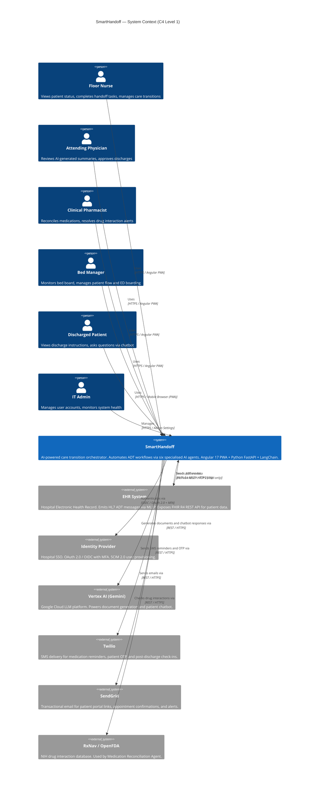

---

## 2. C4 Container Diagram — System Containers

> **Level 2** · What are the deployable containers within SmartHandoff?

```mermaid
C4Container
  title SmartHandoff — Container Diagram (C4 Level 2)

  Person(staff, "Hospital Staff", "Nurses, Physicians, Pharmacists, Bed Managers")
  Person(patient, "Patient", "Post-discharge, mobile browser")

  System_Ext(ehr, "EHR System", "HL7 ADT + FHIR R4")
  System_Ext(idp, "Identity Provider", "OIDC / SCIM")
  System_Ext(vertexai, "Vertex AI", "Gemini LLM")
  System_Ext(notifications, "Twilio / SendGrid", "SMS + Email")
  System_Ext(rxnav, "RxNav / OpenFDA", "Drug Interactions")

  System_Boundary(sh, "SmartHandoff — GCP us-central1") {

    Container(pwa, "Angular 17 PWA", "TypeScript / Angular 17", "Staff dashboard with real-time ADT feed, bed board, medication queue, document review. Patient portal with discharge instructions and chatbot. Served from Cloud CDN.")

    Container(api, "FastAPI Backend", "Python 3.12 / FastAPI", "REST API + SignalR WebSocket hub. JWT auth, RBAC enforcement, PHI audit logging. Reads from Cloud SQL replica for dashboards; writes to primary for commands.")

    Container(hl7, "HL7 Listener", "Python / hl7apy", "MLLP TCP listener on port 2575. Parses HL7 v2.x ADT messages, archives raw messages to Cloud Storage, publishes parsed events to Pub/Sub.")

    Container(pubsub, "GCP Pub/Sub", "Managed Messaging", "adt-events topic with per-agent subscriptions. Dead-letter queues per subscription. Decouples HL7 intake from agent processing.")

    Container(coordinator, "Transition Coordinator Agent", "Python / LangChain", "Orchestrates workflows across all agents on ADT event receipt. Tracks task completion, escalates SLA breaches, pushes status via SignalR.")

    Container(docagent, "Documentation Agent", "Python / LangChain + Vertex AI", "Generates discharge summaries and patient instructions (30s SLA). Completeness checks. Multilingual output. Human review workflow.")

    Container(medagent, "Medication Reconciliation Agent", "Python / LangChain + RxNav", "Compares pre-admission / inpatient / discharge medication lists. Detects interactions, duplicates, missing chronic meds. Pharmacist alerts.")

    Container(bedagent, "Bed Management Agent", "Python / Scikit-learn", "Real-time bed board. Discharge time prediction (ML). Bed assignment scoring. ED boarding alerts.")

    Container(followupagent, "Follow-up Care Agent", "Python / LangChain + Scikit-learn", "Readmission risk scoring (ML). Follow-up appointment scheduling. Medication reminder dispatch. High-risk patient pathway.")

    Container(commsagent, "Patient Communication Agent", "Python / LangChain + Vertex AI", "24/7 patient chatbot (Gemini Flash). Urgency signal detection. Escalation routing. Transcript storage.")

    Container(mlinference, "ML Inference Service", "Python / FastAPI + Scikit-learn", "REST endpoint serving readmission risk model and LOS discharge prediction model.")

    Container(notifysvc, "Notification Service", "Python", "Dispatches SMS (Twilio) and email (SendGrid) from notification-requests Pub/Sub topic. Idempotent delivery with retry.")

    Container(db_primary, "Cloud SQL Primary", "PostgreSQL 15 / CMEK", "ACID transactional writes. PHI field-level AES-256-GCM encryption. Append-only audit_log table. WAL enabled.")

    Container(db_replica, "Cloud SQL Replica", "PostgreSQL 15", "Read-only replica. Materialised views: mv_bed_board (60s), mv_risk_dashboard (5min), mv_kpi_daily (nightly).")

    Container(redis, "Cloud Memorystore", "Redis 7", "Token blocklist for revoked JWTs. Drug interaction result cache (24h TTL). Bed board cache.")

    Container(storage, "Cloud Storage", "GCP Managed", "HIPAA CMEK bucket: raw HL7 archive, audit log WORM export, ML model artifacts. Angular PWA static assets (CDN-served).")
  }

  Rel(staff, pwa, "Uses", "HTTPS")
  Rel(patient, pwa, "Uses", "HTTPS / Mobile Browser")
  Rel(pwa, api, "REST + WebSocket", "HTTPS / SignalR")

  Rel(ehr, hl7, "Sends ADT events", "HL7 v2.x MLLP")
  Rel(hl7, pubsub, "Publishes ADT events", "gRPC")
  Rel(hl7, storage, "Archives raw HL7", "HTTPS")
  Rel(api, ehr, "Reads patient data", "FHIR R4 REST")
  Rel(api, idp, "Validates tokens via", "OIDC JWKS")
  Rel(api, db_primary, "Writes commands to", "TCP / PostgreSQL")
  Rel(api, db_replica, "Reads queries from", "TCP / PostgreSQL")
  Rel(api, redis, "Token blocklist, caches", "Redis protocol")

  Rel(pubsub, coordinator, "Delivers ADT events", "Pub/Sub pull")
  Rel(pubsub, docagent, "Delivers ADT events", "Pub/Sub pull")
  Rel(pubsub, medagent, "Delivers ADT events", "Pub/Sub pull")
  Rel(pubsub, bedagent, "Delivers ADT events", "Pub/Sub pull")
  Rel(pubsub, followupagent, "Delivers ADT events", "Pub/Sub pull")
  Rel(pubsub, commsagent, "Delivers discharge events", "Pub/Sub pull")

  Rel(coordinator, api, "Updates task status via", "REST / SignalR")
  Rel(docagent, vertexai, "Generates documents via", "REST / HTTPS")
  Rel(commsagent, vertexai, "Chatbot responses via", "REST / HTTPS")
  Rel(medagent, rxnav, "Drug interaction checks via", "REST / HTTPS")
  Rel(followupagent, mlinference, "Risk score requests to", "REST / HTTPS")
  Rel(bedagent, mlinference, "LOS predictions from", "REST / HTTPS")

  Rel(followupagent, pubsub, "Publishes notification requests", "gRPC")
  Rel(notifysvc, notifications, "Sends SMS/email via", "REST / HTTPS")

  Rel(coordinator, db_primary, "Writes agent tasks", "TCP")
  Rel(docagent, db_primary, "Writes documents", "TCP")
  Rel(medagent, db_primary, "Writes reconciliation records", "TCP")
  Rel(bedagent, db_primary, "Updates bed status", "TCP")

  UpdateLayoutConfig($c4ShapeInRow="4", $c4BoundaryInRow="2")
```

---

## 3. C4 Component Diagram — AI Agent Subsystem

> **Level 3** · Internal components of the AI Agent subsystem (Documentation Agent shown as representative)

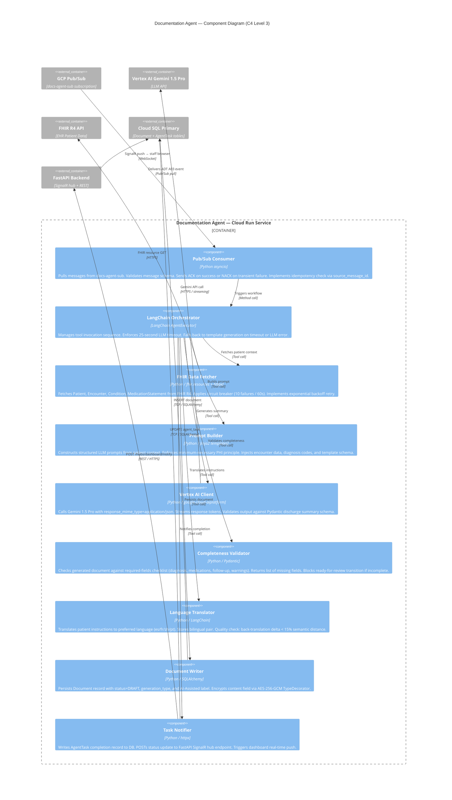

---

## 4. Entity-Relationship Diagram (ERD)

> **Database schema** · Core domain entities with cardinalities and PHI annotations

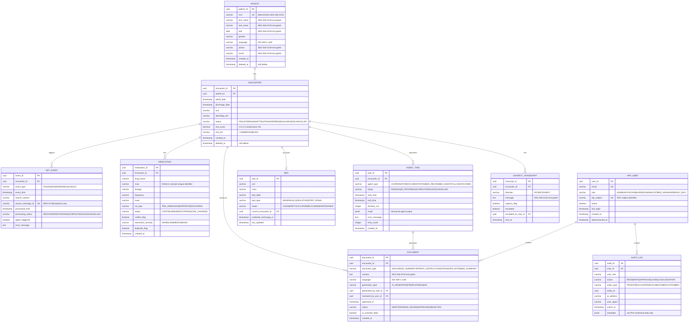

---

## 5. Encounter State Machine

> **State transitions** · Lifecycle of an Encounter from ADT event to close

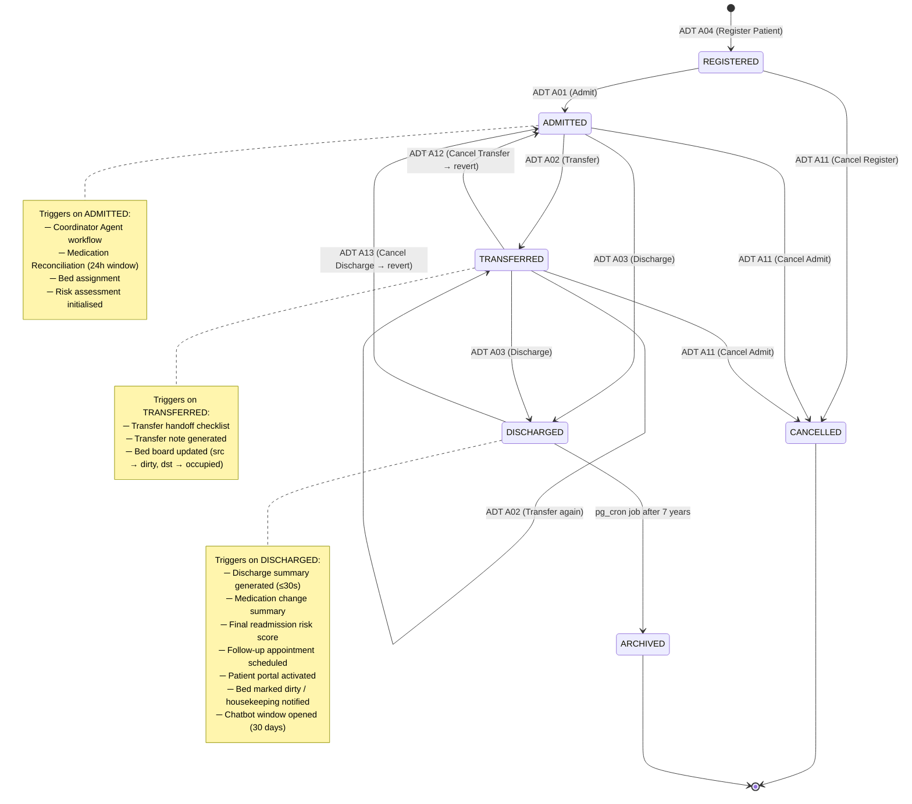

---

## 6. Data Flow — ADT Event Pipeline

> **Data flow** · End-to-end journey from HL7 message receipt to agent execution and dashboard update

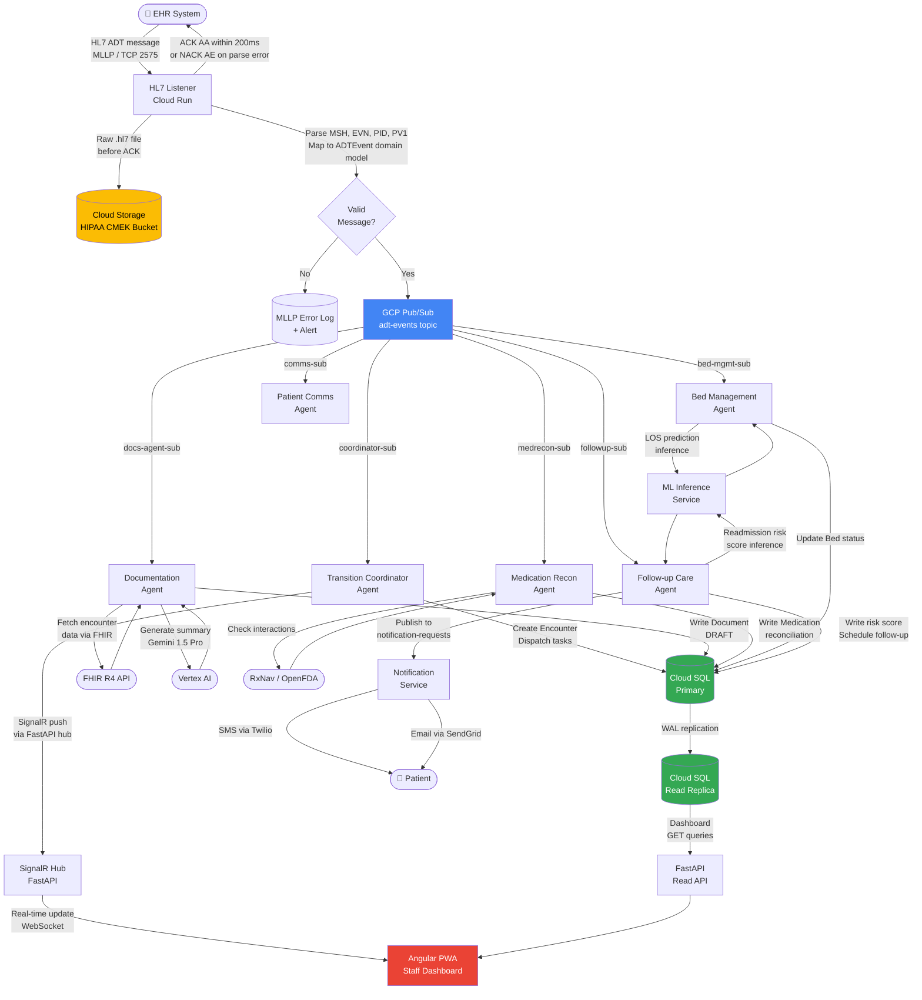

---

## 7. Sequence Diagram — Patient Discharge (UC-003)

> **Actors:** EHR, HL7 Listener, Coordinator Agent, Documentation Agent, Medication Reconciliation Agent, Follow-up Care Agent, Bed Management Agent, Physician, Patient

```mermaid
sequenceDiagram
  autonumber

  participant EHR as 🏥 EHR System
  participant HL7 as HL7 Listener
  participant PS as GCP Pub/Sub
  participant COORD as Coordinator Agent
  participant DOC as Documentation Agent
  participant MED as Med Recon Agent
  participant FUP as Follow-up Agent
  participant BED as Bed Mgmt Agent
  participant ML as ML Inference
  participant FHIR as FHIR R4 API
  participant VTXAI as Vertex AI
  participant DB as Cloud SQL
  participant API as FastAPI / SignalR
  participant UI as Angular Dashboard
  participant PHY as 👨‍⚕️ Physician
  participant PAT as 📱 Patient

  EHR->>HL7: ADT^A03 discharge message (MLLP)
  HL7->>HL7: Archive raw HL7 to Cloud Storage
  HL7-->>EHR: ACK AA (within 200ms)
  HL7->>HL7: Parse PID, PV1, EVN segments
  HL7->>PS: Publish ADTEvent {type:A03, encounterId}

  par Coordinator subscribes
    PS->>COORD: Deliver A03 event
    COORD->>DB: Create AgentTask records (all agents)
    COORD->>DB: Update Encounter.status = DISCHARGING
    COORD->>API: Notify via SignalR → staff dashboard
    API-->>UI: Real-time: "Discharge initiated"
  end

  par Documentation Agent
    PS->>DOC: Deliver A03 event
    DOC->>FHIR: GET Patient, Encounter, Condition, MedicationStatement
    FHIR-->>DOC: Patient data (FHIR R4 resources)
    DOC->>VTXAI: Generate discharge summary (streaming, Gemini 1.5 Pro)
    Note over DOC,VTXAI: 25s timeout; template fallback at 28s
    VTXAI-->>DOC: Structured JSON discharge summary
    DOC->>DOC: Completeness validation
    DOC->>DOC: Translate instructions (patient language)
    DOC->>DB: INSERT Document {type:DISCHARGE_SUMMARY, status:PENDING_REVIEW}
    DOC->>API: Notify: "Discharge summary ready for review"
    API-->>UI: Push: document approval badge
  and Medication Reconciliation Agent
    PS->>MED: Deliver A03 event
    MED->>FHIR: GET MedicationStatement (pre-admit) + MedicationRequest (discharge)
    FHIR-->>MED: Medication lists
    MED->>MED: Compare 3 lists; categorise changes
    MED->>MED: Check drug interactions (RxNav cache → API)
    MED->>DB: INSERT Medication records with conflict/interaction flags
    MED->>DB: INSERT Document {type:MED_SUMMARY}
    MED->>API: Alert if high-risk interaction found
    API-->>UI: Push: pharmacist alert (if triggered)
  and Follow-up Care Agent
    PS->>FUP: Deliver A03 event
    FUP->>ML: POST /predict/readmission {encounterId}
    ML-->>FUP: {risk_score: 0.82, tier: HIGH}
    FUP->>DB: UPDATE Encounter {risk_score:0.82, risk_tier:HIGH}
    FUP->>FUP: Schedule follow-up (within 7 days — BR-003)
    FUP->>DB: INSERT follow-up appointment record
    API-->>UI: Push: HIGH risk flag on patient card
  and Bed Management Agent
    PS->>BED: Deliver A03 event
    BED->>DB: UPDATE Bed {status:DIRTY, current_encounter_id:null}
    BED->>BED: Trigger housekeeping notification (Pub/Sub → Notification Service)
    BED->>API: Refresh mv_bed_board materialised view
    API-->>UI: Push: bed board updated
  end

  PHY->>UI: Open discharge approval queue
  UI->>API: GET /api/v1/encounters/{id}/documents
  API->>DB: SELECT documents WHERE status=PENDING_REVIEW
  DB-->>API: Documents list
  API-->>UI: Discharge summary + medication summary
  PHY->>UI: Review AI-generated discharge summary (dual-pane editor)
  PHY->>UI: Make inline edits (change tracking records authorship)
  PHY->>UI: Click "Approve & Sign"
  UI->>API: PATCH /api/v1/documents/{id}/approve
  API->>DB: UPDATE Document {status:APPROVED, reviewed_by, approved_at}
  API->>DB: INSERT AuditLog {action:APPROVE, entity:DOCUMENT}
  API->>DB: UPDATE Encounter {status:DISCHARGED}
  API-->>UI: Document finalised confirmation

  API->>PS: Publish {type:DISCHARGE_COMPLETE, encounterId}
  PS->>FUP: Deliver DISCHARGE_COMPLETE
  FUP->>FUP: Schedule SMS/email reminders (Notification Service)
  FUP->>PAT: SMS — portal link + appointment confirmation

  PAT->>UI: Opens patient portal link
  UI->>API: GET /portal/instructions (patient JWT)
  API->>DB: SELECT documents WHERE patient_id AND status=APPROVED
  DB-->>API: Discharge instructions (patient language)
  API-->>UI: Personalised discharge instructions
```

---

## 8. Sequence Diagram — Medication Reconciliation (UC-005)

> **Actors:** Medication Reconciliation Agent, FHIR, RxNav, Pharmacist, Physician

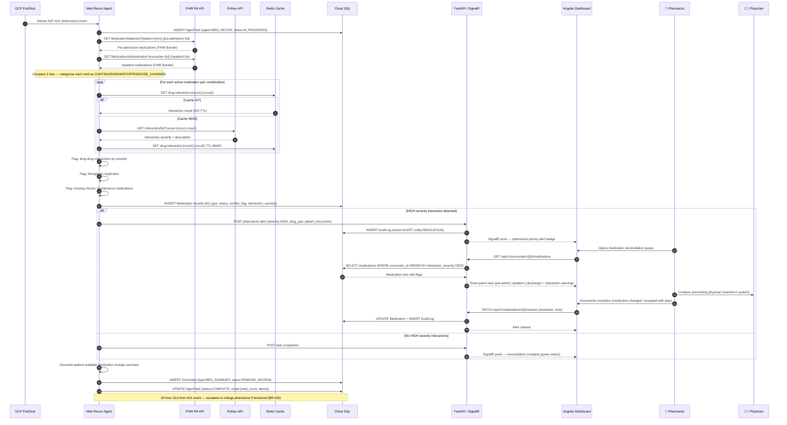

---

## 9. Sequence Diagram — Patient Chatbot (UC-008)

> **Actors:** Patient, Angular PWA (Patient Portal), Patient Communication Agent, Vertex AI, Care Team

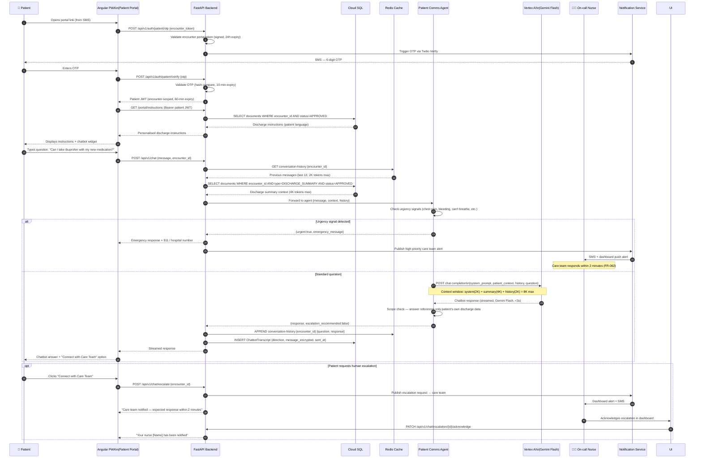

---

## 10. Sequence Diagram — Staff Authentication (UC-010)

> **Actors:** Staff Browser, Angular PWA, FastAPI, Identity Provider (SSO)

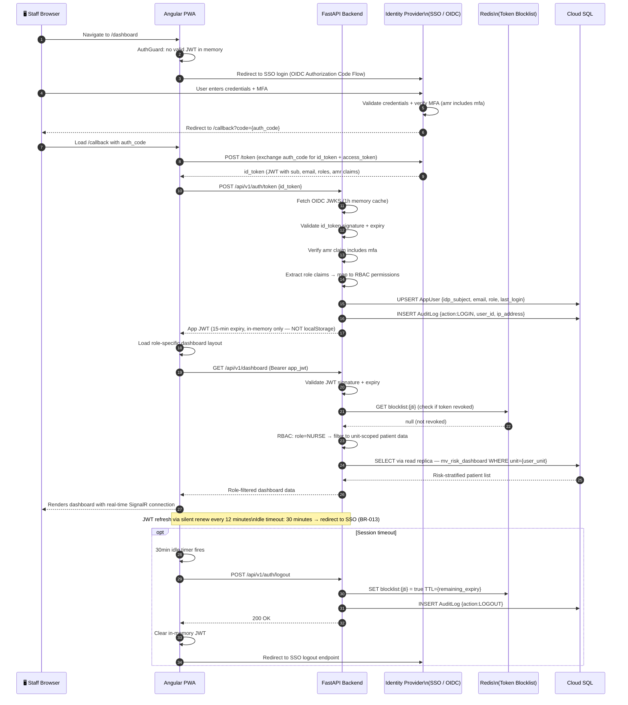

---

## 11. Deployment Diagram — GCP Infrastructure

> **Deployment view** · GCP resources, networking, and service boundaries

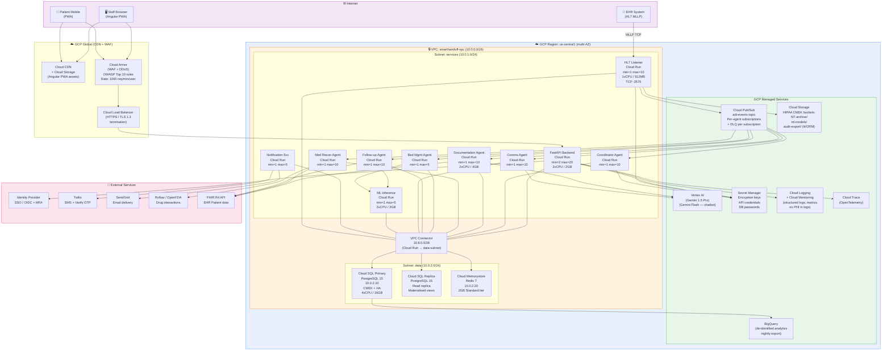

---

## 12. Class Diagram — Domain Model

> **Domain model** · Core domain classes, relationships, and key methods

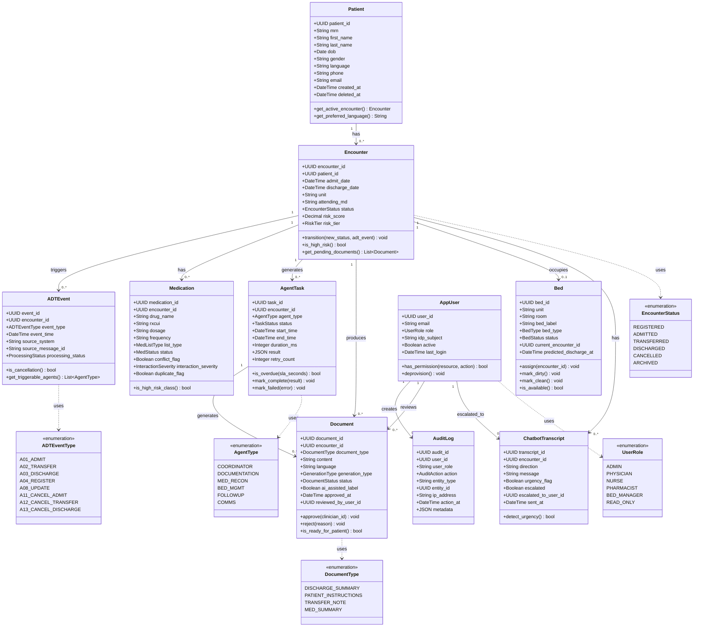

---

*End of SmartHandoff Visual Design Model — Version 1.0 | Generated: 2026-07-13*
