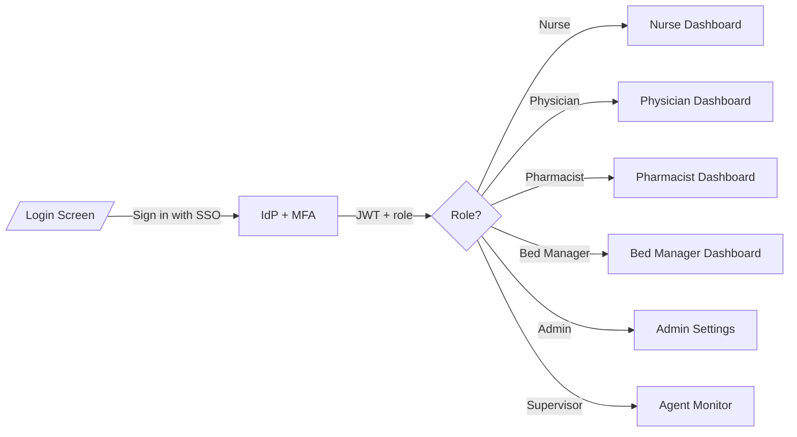
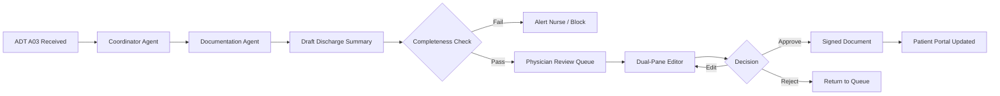
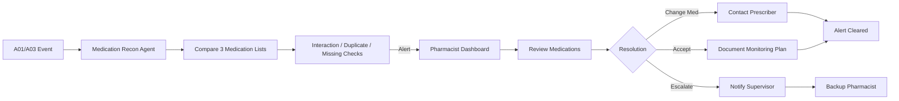
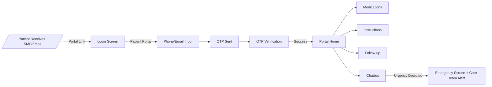
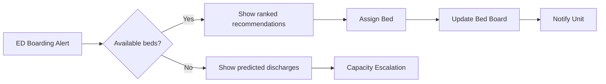

# SmartHandoff — Wireframes

> **Artifact:** wireframes | **Version:** 1.0 | **Status:** Draft  
> **Date:** 2026-08-06 | **Upstream:** SRS v1.0, Figma Spec v1.0  
> **Fidelity:** Low-to-medium (text/ASCII)  
> **Designer:** SmartHandoff Project Team

---

## 1. Site Architecture

```
/login
  │
  ├── /dashboard                (All Staff — role-filtered)
  │     ├── /patients           (Nurse, Physician)
  │     │     └── /patients/:id (All Staff)
  │     │           ├── /patients/:id/medications  (Pharmacist)
  │     │           └── /patients/:id/documents    (Physician, Nurse)
  │     ├── /beds               (Bed Manager)
  │     ├── /analytics          (Manager)
  │     └── /admin              (IT Admin)
  │                 ├── /admin/agents (Supervisor)
  │                 └── /admin (User Mgmt + Audit Log)
  │
  └── /portal                   (Patient — OTP auth)
```

### Route Guards

| Route | Guard | Allowed Roles |
|-------|-------|---------------|
| `/dashboard` | `AuthGuard`, `RoleGuard` | All staff roles |
| `/patients` | `RoleGuard` | Nurse, Physician |
| `/patients/:id/medications` | `RoleGuard` | Pharmacist |
| `/patients/:id/documents` | `RoleGuard` | Physician, Nurse |
| `/beds` | `RoleGuard` | BedManager |
| `/analytics` | `RoleGuard` | Manager |
| `/admin` | `RoleGuard` | Admin |
| `/admin/agents` | `RoleGuard` | Supervisor |
| `/portal` | `PatientAuthGuard` | Patient (OTP) |

---

## 2. Screen Inventory

| ID | Screen | Route | Primary Persona | Priority | Fidelity | Hi-Fi File |
|----|--------|-------|-----------------|----------|----------|------------|
| WF-001 | Login | `/login` | All | Must Have | Medium | [SCR-001](../.propel/context/wireframes/Hi-Fi/wireframe-SCR-001-login.html) |
| WF-002 | Dashboard Home | `/dashboard` | All Staff | Must Have | Medium | [SCR-002](../.propel/context/wireframes/Hi-Fi/wireframe-SCR-002-dashboard-home.html) |
| WF-003 | Patient List | `/patients` | Nurse, Physician | Must Have | Medium | [SCR-003](../.propel/context/wireframes/Hi-Fi/wireframe-SCR-003-patient-list.html) |
| WF-004 | Patient Detail | `/patients/:id` | All Staff | Must Have | Medium | [SCR-004](../.propel/context/wireframes/Hi-Fi/wireframe-SCR-004-patient-detail.html) |
| WF-005 | Medication Review | `/patients/:id/medications` | Pharmacist | Must Have | Medium | [SCR-005](../.propel/context/wireframes/Hi-Fi/wireframe-SCR-005-medication-review.html) |
| WF-006 | Document Review | `/patients/:id/documents` | Physician, Nurse | Must Have | Medium | [SCR-006](../.propel/context/wireframes/Hi-Fi/wireframe-SCR-006-document-review.html) |
| WF-007 | Bed Board | `/beds` | Bed Manager | Should Have | Medium | [SCR-007](../.propel/context/wireframes/Hi-Fi/wireframe-SCR-007-bed-board.html) |
| WF-008 | Agent Monitor | `/admin/agents` | Supervisor | Should Have | Medium | [SCR-008](../.propel/context/wireframes/Hi-Fi/wireframe-SCR-008-agent-monitor.html) |
| WF-009 | Analytics Dashboard | `/analytics` | Manager | Should Have | Medium | [SCR-009](../.propel/context/wireframes/Hi-Fi/wireframe-SCR-009-analytics-dashboard.html) |
| WF-010 | Patient Portal Home | `/portal` | Patient | Must Have | Medium | [SCR-010](../.propel/context/wireframes/Hi-Fi/wireframe-SCR-010-patient-portal.html) |
| WF-011 | Patient Portal Medications | `/portal/medications` | Patient | Must Have | Medium | [SCR-010a](../.propel/context/wireframes/Hi-Fi/wireframe-SCR-010a-patient-portal-medications.html) |
| WF-012 | Patient Portal Instructions | `/portal/instructions` | Patient | Must Have | Medium | [SCR-010b](../.propel/context/wireframes/Hi-Fi/wireframe-SCR-010b-patient-portal-instructions.html) |
| WF-013 | Patient Portal Follow-up | `/portal/follow-up` | Patient | Should Have | Medium | [SCR-010c](../.propel/context/wireframes/Hi-Fi/wireframe-SCR-010c-patient-portal-follow-up.html) |
| WF-014 | Admin Settings | `/admin` | IT Admin | Must Have | Medium | [SCR-011](../.propel/context/wireframes/Hi-Fi/wireframe-SCR-011-admin-settings.html) |

---

## 2.1 Hi-Fi Wireframe Index

Interactive high-fidelity wireframes are stored in [`.propel/context/wireframes/Hi-Fi/`](../.propel/context/wireframes/Hi-Fi/). Open any `.html` file in a browser to view the rendered wireframe. Each file includes:

- A metadata bar with screen ID, route, persona, priority, and use-case refs.
- Design tokens aligned with the SmartHandoff design system.
- Multiple states where applicable (e.g., login default + OTP, portal home + chatbot + emergency).
- UXR/FR traceability tags.

### Recently completed additions

To close gaps against the Figma spec and SRS, the following Hi-Fi wireframes were added:

- [SCR-010a — Patient Portal Medications](../.propel/context/wireframes/Hi-Fi/wireframe-SCR-010a-patient-portal-medications.html)
- [SCR-010b — Patient Portal Instructions](../.propel/context/wireframes/Hi-Fi/wireframe-SCR-010b-patient-portal-instructions.html)
- [SCR-010c — Patient Portal Follow-up](../.propel/context/wireframes/Hi-Fi/wireframe-SCR-010c-patient-portal-follow-up.html)

---

## 2.2 Interactive Navigation

Every Hi-Fi wireframe now includes two levels of interactive navigation for rapid prototyping and walkthroughs:

1. **Global footer navigation panel** — A persistent "🧭 Wireframe Navigation" bar at the bottom of each screen that links to all 14 Hi-Fi screens, grouped by **Auth**, **Staff**, and **Portal**. The current screen is highlighted.
2. **Contextual in-page links** — Key UI elements inside each wireframe are wired to their natural destinations:

| Screen | Clickable elements | Destination |
|--------|-------------------|-------------|
| SCR-001 Login | Hospital SSO button | SCR-002 Dashboard |
| SCR-001 Login | Send Code (OTP) | SCR-010 Patient Portal Home |
| SCR-002 Dashboard | Logo, Dashboard nav, View all patients | SCR-002 Dashboard / SCR-003 Patient List |
| SCR-002 Dashboard | Patients nav, patient task names | SCR-003 Patient List / SCR-004 Patient Detail |
| SCR-002 Dashboard | Bed Board / Analytics / Admin nav | SCR-007 / SCR-009 / SCR-011 |
| SCR-003 Patient List | Logo, Dashboard nav, View buttons, patient names | SCR-002 Dashboard / SCR-004 Patient Detail |
| SCR-004 Patient Detail | Logo → Dashboard, Back → Patient List, Medications/Documents tabs, alerts, Review & Approve | SCR-002 / SCR-003 / SCR-005 / SCR-006 |
| SCR-005 Medication Review | Logo → Dashboard, Back → Patient Detail, Complete Reconciliation | SCR-002 / SCR-004 |
| SCR-006 Document Review | Logo → Dashboard, Back → Patient Detail, Approve & Sign | SCR-002 / SCR-004 |
| SCR-007 Bed Board | Logo → Dashboard, occupied bed tiles | SCR-002 / SCR-004 |
| SCR-008 Agent Monitor | Logo, Dashboard nav, Admin Settings nav | SCR-002 / SCR-011 |
| SCR-009 Analytics | Logo, Dashboard nav | SCR-002 |
| SCR-010 Portal Home | Medications / Instructions / Follow-up cards | SCR-010a / SCR-010b / SCR-010c |
| SCR-010a/b/c | Back button | SCR-010 Patient Portal Home |
| SCR-011 Admin Settings | Logo, Dashboard nav | SCR-002 |

> **Note:** These links are prototyping aids only. The production Angular application will use Angular Router, route guards, and parameterized routes (e.g., `/patients/:id`).

---

## 3. Global Components

### 3.1 Staff Dashboard Shell

```
┌──────────────────────────────────────────────────────────────────────────┐
│ [Logo] SmartHandoff     [Search patients...]  [🔔 N]  [Avatar ▾]        │
├──────────────────────────────────────────────────────────────────────────┤
│  Nav: Dashboard | Patients | [Bed Board*] | [Analytics*] | [Admin*]     │
│  (* = role-gated)                                                        │
└──────────────────────────────────────────────────────────────────────────┘
```

**Components:**

- `TopAppBar` — logo, global search, notification bell, user menu
- `RoleFilteredNav` — navigation items filtered by JWT role claims
- `NotificationBell` — unread count, priority grouping (critical/warning/info)
- `SessionTimeoutBanner` — T-5 minute warning with "Stay Logged In"
- `ToastNotification` — top-right, 5s auto-dismiss, `aria-live="polite"`

### 3.2 Patient Portal Shell (Mobile)

```
┌─────────────────────────────┐
│ [Logo] SmartHandoff    [EN▾]│
├─────────────────────────────┤
│  [Screen content]           │
│                             │
│                             │
│       ┌──────────────────┐  │
│       │  💬 Ask a        │  │
│       │  Question        │  │
│       └──────────────────┘  │
└─────────────────────────────┘
```

**Components:**

- `PortalHeader` — logo, persistent language selector
- `ChatWidgetFAB` — fixed bottom-right chatbot trigger
- `BottomNav` (optional) — Home / Medications / Instructions / Follow-up

---

## 4. Staff Dashboard Wireframes

### WF-001 — Login

#### Default State

```
┌──────────────────────────────────────────────────────┐
│                                                      │
│           [SmartHandoff Logo]                        │
│         AI-Powered Care Transitions                  │
│                                                      │
│   ┌──────────────────────────────────────────────┐   │
│   │          Staff Login                         │   │
│   │                                              │   │
│   │  [Hospital SSO Button — "Sign in with SSO"]  │   │
│   │                                              │   │
│   │  ──────────── or ────────────                │   │
│   │                                              │   │
│   │  Are you a patient?                          │   │
│   │  [Patient Portal Link]                       │   │
│   └──────────────────────────────────────────────┘   │
│                                                      │
│   Version 1.0 | HIPAA Compliant | © SmartHandoff     │
└──────────────────────────────────────────────────────┘
```

#### Patient OTP State

```
┌──────────────────────────────────────────────────────┐
│                                                      │
│           [SmartHandoff Logo]                        │
│         AI-Powered Care Transitions                  │
│                                                      │
│   ┌──────────────────────────────────────────────┐   │
│   │          Patient Portal                      │   │
│   │                                              │   │
│   │  Enter your phone or email                   │   │
│   │  [________________________]                  │   │
│   │                                              │   │
│   │  [Send OTP]                                  │   │
│   │                                              │   │
│   │  ──────────── or ────────────                │   │
│   │  [← Back to Staff Login]                     │   │
│   └──────────────────────────────────────────────┘   │
│                                                      │
└──────────────────────────────────────────────────────┘
```

#### OTP Verification State

```
┌──────────────────────────────────────────────────────┐
│                                                      │
│   ┌──────────────────────────────────────────────┐   │
│   │          Verify Identity                     │   │
│   │                                              │   │
│   │  Code sent to +1 *** *** 1234                │   │
│   │  [____] [____] [____] [____] [____] [____]  │   │
│   │                                              │   │
│   │  [Verify]  [Resend code in 00:30]            │   │
│   └──────────────────────────────────────────────┘   │
│                                                      │
└──────────────────────────────────────────────────────┘
```

**User Flow:**

1. User selects staff or patient path.
2. Staff → IdP SSO + MFA → JWT issued → role-based redirect to `/dashboard`.
3. Patient → phone/email → OTP → `/portal`.

---

### WF-002 — Dashboard Home

#### Nurse / Physician View (1440px)

```
┌──────────────────────────────────────────────────────────────────────────┐
│ [Logo] SmartHandoff     [Search patients...]  [🔔 3]  [Avatar ▾]        │
├──────────────────────────────────────────────────────────────────────────┤
│  Nav: Dashboard | Patients | [Bed Board*] | [Analytics*] | [Admin*]     │
├──────────────────────────────────────────────────────────────────────────┤
│  ┌─────────────────────────────┐  ┌────────────────────────────────────┐ │
│  │  MY PENDING TASKS (7)       │  │  LIVE ADT EVENT FEED               │ │
│  │  ─────────────────────────  │  │  ─────────────────────────────── │ │
│  │  ● Discharge checklist      │  │  A03 — Smith, J — Unit 4W — 14:32 │ │
│  │    [Patient: Smith, J]      │  │  A01 — Patel, R — Unit 3N — 14:29 │ │
│  │    Due: 15:00   [URGENT]   │  │  A02 — Nguyen, L — 4W→ICU — 14:25 │ │
│  │  ● Review handoff checklist │  │                         [Pause ⏸] │ │
│  │    [Patient: Patel, R]      │  └────────────────────────────────────┘ │
│  │    Due: 16:30               │                                         │
│  │  ● Medication approval      │  ┌────────────────────────────────────┐ │
│  │    [Patient: Nguyen, L]     │  │  ACTIVE PATIENTS — RISK OVERVIEW   │ │
│  │    Due: ASAP  [CRITICAL]   │  │  ─────────────────────────────── │ │
│  │  [View All Tasks →]         │  │  ● Smith, J    ████ 0.82 [HIGH]   │ │
│  └─────────────────────────────┘  │  ● Patel, R    ██░░ 0.45 [MED]    │ │
│                                   │  ● Nguyen, L   █░░░ 0.18 [LOW]    │ │
│  ┌─────────────────────────────┐  │  [View All Patients →]            │ │
│  │  AGENT STATUS               │  └────────────────────────────────────┘ │
│  │  ─────────────────────────  │                                         │
│  │  Transition  ✓ Active       │                                         │
│  │  Documentation ✓ Active     │                                         │
│  │  Medication  ⚠ 2 alerts     │                                         │
│  │  Bed Mgmt    ✓ Active       │                                         │
│  │  Follow-up   ✓ Active       │                                         │
│  │  Patient Comms ✓ Active     │                                         │
│  └─────────────────────────────┘                                         │
└──────────────────────────────────────────────────────────────────────────┘
```

#### Pharmacist View

```
┌──────────────────────────────────────────────────────────────────────────┐
│ [Logo] SmartHandoff     [Search patients...]  [🔔 5]  [Avatar ▾]        │
├──────────────────────────────────────────────────────────────────────────┤
│  Nav: Dashboard | Patients | [Analytics*] | [Admin*]                    │
├──────────────────────────────────────────────────────────────────────────┤
│  ┌─────────────────────────────┐  ┌────────────────────────────────────┐ │
│  │  MED RECON QUEUE (5)        │  │  CRITICAL INTERACTION ALERTS       │ │
│  │  ─────────────────────────  │  │  ─────────────────────────────── │ │
│  │  ● Smith, J — 4W            │  │  🔴 Warfarin + Aspirin             │ │
│  │    Due: 15:00  [CRITICAL]  │  │    Smith, J | 4W | [Review →]      │ │
│  │  ● Patel, R — 3N            │  │  🟡 Metformin missing              │ │
│  │    Due: 16:30  [WARNING]   │  │    Patel, R | 3N | [Review →]      │ │
│  │  ● Nguyen, L — ICU          │  │                                    │ │
│  │    Due: 18:00               │  │                                    │ │
│  │  [View All Tasks →]         │  └────────────────────────────────────┘ │
│  └─────────────────────────────┘                                         │
│  ┌─────────────────────────────┐  ┌────────────────────────────────────┐ │
│  │  RECON COMPLETION RATE      │  │  ADT EVENT FEED                    │ │
│  │  ─────────────────────────  │  │  ─────────────────────────────── │ │
│  │  96.4%  ↑ +2.1% (30d)      │  │  A03 — Smith, J — Unit 4W — 14:32 │ │
│  │  [View Analytics →]         │  │  A01 — Patel, R — Unit 3N — 14:29 │ │
│  └─────────────────────────────┘  └────────────────────────────────────┘ │
└──────────────────────────────────────────────────────────────────────────┘
```

#### Bed Manager View

```
┌──────────────────────────────────────────────────────────────────────────┐
│ [Logo] SmartHandoff     [Search patients...]  [🔔 2]  [Avatar ▾]        │
├──────────────────────────────────────────────────────────────────────────┤
│  Nav: Dashboard | Bed Board | [Analytics*] | [Admin*]                   │
├──────────────────────────────────────────────────────────────────────────┤
│  ┌────────────────────────────────────────────────────────────────────┐   │
│  │  ED BOARDING ALERT — Patient pending for 2h 15m                    │   │
│  │  Patient: Garcia, M  |  Unit: Pending  |  Acuity: High             │   │
│  │  Recommended beds: [4W-03 ✓] [3N-07] [3N-12]                     │   │
│  │  [Assign 4W-03 →]   [View All Available]   [Dismiss ✗]             │   │
│  └────────────────────────────────────────────────────────────────────┘   │
│  ┌─────────────────────────────┐  ┌────────────────────────────────────┐ │
│  │  BED BOARD SNAPSHOT         │  │  PREDICTED DISCHARGES              │ │
│  │  ─────────────────────────  │  │  ─────────────────────────────── │ │
│  │  Occupied: 142              │  │  Jones (4W-05) — 16:00 (±2h)       │ │
│  │  Available: 18              │  │  Patel (4W-04) — 18:30 (±2h)       │ │
│  │  Dirty: 12                  │  │  Lee (3N-02) — 19:15 (±2h)         │ │
│  │  Blocked: 3                 │  │  [View Bed Board →]                │ │
│  │  [Open Bed Board →]         │  └────────────────────────────────────┘ │
│  └─────────────────────────────┘                                         │
│  ┌─────────────────────────────┐                                          │
│  │  ADT EVENT FEED             │                                          │
│  │  ─────────────────────────  │                                          │
│  │  A03 — Smith, J — Unit 4W   │                                          │
│  │  A01 — Garcia, M — ED→Pending│                                         │
│  └─────────────────────────────┘                                          │
└──────────────────────────────────────────────────────────────────────────┘
```

**States:**

- Skeleton loading
- No tasks empty state
- Critical alert interrupt modal
- Session timeout warning banner
- Agent failure status

---

### WF-003 — Patient List

```
┌──────────────────────────────────────────────────────────────────────────┐
│ [Global Nav]                                                             │
├──────────────────────────────────────────────────────────────────────────┤
│  Patients   [🔍 Search by name or MRN...]   [Filter ▾]  [Unit ▾]       │
│                                                                          │
│  ┌──────┬──────────────┬────────┬──────────────┬──────────┬───────────┐  │
│  │ MRN  │ Name         │ Unit   │ Status       │ Risk     │ Actions   │  │
│  ├──────┼──────────────┼────────┼──────────────┼──────────┼───────────┤  │
│  │ ●●●● │ Smith, John  │ 4W     │ Admitted     │ ████0.82 │ [View]    │  │
│  │ ●●●● │ Patel, Rita  │ 3N     │ Discharging  │ ██░░0.45 │ [View]    │  │
│  │ ●●●● │ Nguyen, Lee  │ ICU    │ Transferred  │ █░░░0.18 │ [View]    │  │
│  │ ●●●● │ Garcia, Maria│ ED     │ Pending      │ ████0.71 │ [View]    │  │
│  │ ●●●● │ Jones, Mark  │ 4W     │ Discharged   │ █░░░0.12 │ [View]    │  │
│  └──────┴──────────────┴────────┴──────────────┴──────────┴───────────┘  │
│                                                                          │
│  Showing 1–25 of 142   [< Prev] [1] [2] [3] [Next >]                   │
│  Rows per page: [25 ▾]                                                   │
└──────────────────────────────────────────────────────────────────────────┘
```

**States:**

- Skeleton loading
- Search active with filtered results
- Empty search state
- MRN masked/revealed toggle
- Sort by column header

---

### WF-004 — Patient Detail

#### Overview Tab

```
┌──────────────────────────────────────────────────────────────────────────┐
│ [Global Nav]    ← Back to Patients                                       │
├──────────────────────────────────────────────────────────────────────────┤
│  Smith, John  MRN: ●●●●●●   DOB: ●●/●●/●●●●   Unit: 4-West  Bed: 4W-12 │
│  ━━━━━━━━━━━━━━━━━━━━━━━━━━━━━━━━━━━━━━━━━━━━━━━━━━━━━━━━━━━━━━━━━━━━━  │
│  Attending: Dr. Chen  |  Admitted: 2026-07-10  |  Risk: ████ 0.82 HIGH  │
├──────────────────────────────────────────────────────────────────────────┤
│  Tabs: [Overview] [Medications] [Documents] [Tasks] [Timeline]           │
│                                                                          │
│  ── OVERVIEW TAB ──                                                      │
│  ┌───────────────────────────┐  ┌────────────────────────────────────┐   │
│  │ AGENT TASK STATUS         │  │ PENDING APPROVALS (1)              │   │
│  │ ─────────────────────── │  │ ─────────────────────────────────  │   │
│  │ ✓ Transition Coord.      │  │ [AI-Assisted — Review Required]    │   │
│  │ ✓ Documentation          │  │ Discharge Summary — Draft          │   │
│  │ ⚠ Medication Recon.      │  │ Generated 14:32 · 30 sec          │   │
│  │ ✓ Bed Management         │  │ [Review & Approve →]               │   │
│  │ ● Follow-up (pending)    │  └────────────────────────────────────┘   │
│  │ ✓ Patient Comms          │                                           │
│  └───────────────────────────┘  ┌────────────────────────────────────┐   │
│                                 │ READMISSION RISK                   │   │
│  ┌───────────────────────────┐  │ ─────────────────────────────────  │   │
│  │ ACTIVE ALERTS (2)         │  │ Score: 0.82                        │   │
│  │ ─────────────────────── │  │ ████████████████████ HIGH RISK     │   │
│  │ 🔴 Drug interaction:      │  │                                    │   │
│  │    Warfarin + Aspirin     │  │ Contributing factors:              │   │
│  │    [Resolve →]            │  │ • Prior admission <30 days         │   │
│  │ 🟡 Chronic med missing:   │  │ • ≥3 medications changed           │   │
│  │    Metformin not on DC Rx │  │ • HF diagnosis                     │   │
│  │    [Review →]             │  │                                    │   │
│  └───────────────────────────┘  │ [View Care Plan →]                 │   │
│                                 └────────────────────────────────────┘   │
└──────────────────────────────────────────────────────────────────────────┘
```

#### Tasks Tab

```
┌──────────────────────────────────────────────────────────────────────────┐
│  Tabs: [Overview] [Medications] [Documents] [Tasks] [Timeline]           │
│                                                                          │
│  ── TASKS TAB ──                                                         │
│  ┌─────────────────┬──────────────┬─────────────┬──────────┬───────────┐ │
│  │ Task            │ Agent        │ Status      │ Started  │ Duration  │ │
│  ├─────────────────┼──────────────┼─────────────┼──────────┼───────────┤ │
│  │ FHIR Fetch      │ Transition   │ ✓ Complete  │ 14:28    │ 12s       │ │
│  │ Discharge Summary│ Documentation│ ✓ Complete  │ 14:29    │ 28s       │ │
│  │ Med Reconciliation│ Medication  │ ⚠ Alert     │ 14:29    │ 2m 14s    │ │
│  │ Bed Assignment  │ Bed Mgmt     │ ✓ Complete  │ 14:30    │ 5s        │ │
│  │ Risk Score      │ Follow-up    │ ✓ Complete  │ 14:31    │ 8s        │ │
│  │ Portal Prep     │ Patient Comms│ ● Pending   │ 14:32    │ --        │ │
│  └─────────────────┴──────────────┴─────────────┴──────────┴───────────┘ │
└──────────────────────────────────────────────────────────────────────────┘
```

#### Timeline Tab

```
┌──────────────────────────────────────────────────────────────────────────┐
│  Tabs: [Overview] [Medications] [Documents] [Tasks] [Timeline]           │
│                                                                          │
│  ── TIMELINE TAB ──                                                      │
│  ┌────────────────────────────────────────────────────────────────────┐   │
│  │ 2026-07-14 14:32 | A03 Discharge event received from EHR           │   │
│  │ 2026-07-14 14:31 | Follow-up Care Agent: risk score 0.82 calculated│   │
│  │ 2026-07-14 14:30 | Bed Management Agent: bed 4W-12 assigned        │   │
│  │ 2026-07-14 14:29 | Medication Recon Agent: 2 alerts detected       │   │
│  │ 2026-07-14 14:28 | A01 Admit event received; encounter created     │   │
│  └────────────────────────────────────────────────────────────────────┘   │
└──────────────────────────────────────────────────────────────────────────┘
```

---

### WF-005 — Medication Review

```
┌──────────────────────────────────────────────────────────────────────────┐
│ [Global Nav]   Patient: Smith, J   ←  Back to Patient Detail            │
├──────────────────────────────────────────────────────────────────────────┤
│  MEDICATION RECONCILIATION                    [AI-Assisted — Review Required] │
│                                                                          │
│  ┌────────────────────┬───────────────────┬──────────────────────────┐   │
│  │ PRE-ADMISSION      │ INPATIENT         │ DISCHARGE Rx             │   │
│  │ (FHIR Statement)   │ (FHIR Admin.)     │ (FHIR Request)          │   │
│  ├────────────────────┼───────────────────┼──────────────────────────┤   │
│  │ Warfarin 5mg QD    │ Warfarin 5mg QD   │ Warfarin 5mg QD ✓       │   │
│  │ Aspirin 81mg QD    │ Aspirin 81mg QD   │ Aspirin 81mg QD ⚠INTER  │   │
│  │ Metformin 500mg BD │ Metformin 500mg BD│ ── MISSING ──  ⚠CHRONIC │   │
│  │ Lisinopril 10mg QD │ Lisinopril 10mg QD│ Lisinopril 10mg QD ✓    │   │
│  └────────────────────┴───────────────────┴──────────────────────────┘   │
│                                                                          │
│  ACTIVE ALERTS                                                           │
│  ┌──────────────────────────────────────────────────────────────────┐   │
│  │ 🔴 MAJOR INTERACTION: Warfarin + Aspirin                          │   │
│  │ Severity: Major | Risk: Increased bleeding                        │   │
│  │ Rationale: Pharmacodynamic synergy; INR may rise significantly    │   │
│  │ [Contact Prescriber] [Accept with Plan] [View Evidence]          │   │
│  ├──────────────────────────────────────────────────────────────────┤   │
│  │ 🟡 CHRONIC MED MISSING: Metformin 500mg BD                       │   │
│  │ Not found on Discharge Rx. Patient has Type 2 Diabetes.          │   │
│  │ [Flag for Physician] [Mark Intentional Omission]                 │   │
│  └──────────────────────────────────────────────────────────────────┘   │
│                                                                          │
│  [Generate Patient Medication Summary]   [Complete Reconciliation ✓]    │
└──────────────────────────────────────────────────────────────────────────┘
```

**States:**

- Skeleton loading
- Critical alert interrupt modal
- Resolution recorded
- Reconciliation complete
- 24h SLA escalation countdown

---

### WF-006 — Document Review

```
┌──────────────────────────────────────────────────────────────────────────┐
│ [Global Nav]   Document Review — Smith, John — Discharge Summary        │
│ [AI-Assisted — Review Required]                                          │
├──────────────────────────────────────────────────────────────────────────┤
│  ┌──────────────────────────────┬─────────────────────────────────────┐  │
│  │  AI DRAFT (read-only)        │  EDITABLE VERSION                   │  │
│  │  Generated: 14:32            │  Last saved: 14:38 (auto-save)      │  │
│  │  ────────────────────────── │  ───────────────────────────────── │  │
│  │  DISCHARGE SUMMARY           │  DISCHARGE SUMMARY                  │  │
│  │                              │                                     │  │
│  │  Patient: John Smith         │  Patient: John Smith                │  │
│  │  Admission: 2026-07-10       │  Admission: 2026-07-10              │  │
│  │  Discharge: 2026-07-14       │  Discharge: 2026-07-14              │  │
│  │                              │                                     │  │
│  │  Primary Diagnosis:          │  Primary Diagnosis:                 │  │
│  │  Congestive Heart Failure    │  Congestive Heart Failure           │  │
│  │  (I50.9)                     │  (I50.9) [EDITED ✎]                │  │
│  │                              │                                     │  │
│  │  Hospital Course:            │  Hospital Course:                   │  │
│  │  Patient presented with...   │  Patient presented with...  [+Add] │  │
│  │  [HIGHLIGHTED DIFF ██████]   │                                     │  │
│  └──────────────────────────────┴─────────────────────────────────────┘  │
│                                                                          │
│  Change log: [2 edits by Dr. Chen — 14:37]                              │
│                                                                          │
│  [← Reject & Return]  [Save Draft]  [Approve & Sign ✓]                  │
└──────────────────────────────────────────────────────────────────────────┘
```

**States:**

- AI draft pending
- Editing with auto-save
- Completeness failure banner
- Approval confirmation modal
- Approved (locked)
- Rejected with reason input
- Vertex AI fallback banner

---

### WF-007 — Bed Board

```
┌──────────────────────────────────────────────────────────────────────────┐
│ [Global Nav]   BED BOARD — LIVE VIEW   Last updated: 14:39:01  [↻]     │
├──────────────────────────────────────────────────────────────────────────┤
│  Filter: [All Units ▾]  [All Status ▾]   Legend: ■Clean ■Dirty ■Occup ■Block │
│                                                                          │
│  UNIT 4-WEST                                                            │
│  ┌──────┬──────┬──────┬──────┬──────┬──────┬──────┬──────┐            │
│  │4W-01 │4W-02 │4W-03 │4W-04 │4W-05 │4W-06 │4W-07 │4W-08 │            │
│  │OCCUP │DIRTY │ CLEAN│OCCUP │OCCUP │BLOCK │OCCUP │ CLEAN│            │
│  │Smith │ HK ─ │ AVAIL│Patel │Jones │Maint.│Lee   │ AVAIL│            │
│  │0.82🔴│      │      │0.45🟡│0.20🟢│      │0.18🟢│      │            │
│  │DC:16h│      │      │DC:32h│DC:8h │      │DC:24h│      │            │
│  └──────┴──────┴──────┴──────┴──────┴──────┴──────┴──────┘            │
│                                                                          │
│  UNIT 3-NORTH                                                           │
│  ┌──────┬──────┬──────┬──────┬──────┬──────┬──────┬──────┐            │
│  │3N-01 │3N-02 │3N-03 │3N-04 │3N-05 │3N-06 │3N-07 │3N-08 │            │
│  │OCCUP │OCCUP │ CLEAN│OCCUP │ DIRTY│ CLEAN│ AVAIL│ BLOCK│            │
│  │Davis │Brown │      │Wilson│      │      │      │HVAC  │            │
│  │0.33🟢│0.51🟡│      │0.67🟡│      │      │      │      │            │
│  └──────┴──────┴──────┴──────┴──────┴──────┴──────┴──────┘            │
│                                                                          │
│  ┌──────────────────────────────────────────────────────────────┐      │
│  │  🚨 ED BOARDING ALERT — Patient pending for 2h 15m           │      │
│  │  Patient: Garcia, M  |  Unit: Pending  |  Acuity: High       │      │
│  │  Recommended beds: [4W-03 ✓] [3N-07] [3N-12]               │      │
│  │  [Assign 4W-03 →]   [View All Available]   [Dismiss ✗]       │      │
│  └──────────────────────────────────────────────────────────────┘      │
│                                                                          │
│  PREDICTED DISCHARGES (next 4 hours)                                    │
│  Jones (4W-05) — 16:00 (±2h)  |  Patel (4W-04) — 18:30 (±2h)          │
└──────────────────────────────────────────────────────────────────────────┘
```

**States:**

- Default floor-plan grid
- ED boarding alert banner
- Bed assignment confirmation modal
- Housekeeping notification on dirty tiles

---

### WF-008 — Agent Monitor

```
┌──────────────────────────────────────────────────────────────────────────┐
│ [Global Nav]   AGENT HEALTH MONITOR   Last updated: 14:39:05  [↻]      │
├──────────────────────────────────────────────────────────────────────────┤
│  ┌──────────────────┬─────────┬──────────┬───────────┬────────┬───────┐  │
│  │ Agent            │ Status  │ Tasks/hr │ Success % │ Avg ms │ Queue │  │
│  ├──────────────────┼─────────┼──────────┼───────────┼────────┼───────┤  │
│  │ Transition Coord.│ ✓ LIVE  │   42     │   99.8%   │  320   │  0    │  │
│  │ Documentation    │ ✓ LIVE  │   18     │   98.1%   │ 28,400 │  2    │  │
│  │ Medication Recon.│ ⚠ WARN  │   12     │   94.5%   │  450   │  5    │  │
│  │ Bed Management   │ ✓ LIVE  │   38     │  100.0%   │  180   │  0    │  │
│  │ Follow-up Care   │ ✓ LIVE  │   22     │   97.3%   │  520   │  1    │  │
│  │ Patient Comms    │ ✓ LIVE  │   60     │   99.2%   │  810   │  0    │  │
│  └──────────────────┴─────────┴──────────┴───────────┴────────┴───────┘  │
│                                                                          │
│  FAILED TASKS (3)                                                        │
│  ┌─────────────────────────────────────────────────────────────────┐    │
│  │ Task #8821 — Medication Recon — Encounter #2041                  │    │
│  │ Error: FHIR timeout after 30s | Attempt: 3/3                    │    │
│  │ [View Details]  [Retry]  [Escalate to On-Call]                  │    │
│  └─────────────────────────────────────────────────────────────────┘    │
│                                                                          │
│  INFRASTRUCTURE                                                          │
│  Pub/Sub lag: 0.2s  |  Cloud SQL latency: 12ms  |  Cloud Run: 3/4 pods │
└──────────────────────────────────────────────────────────────────────────┘
```

---

### WF-009 — Analytics Dashboard

```
┌──────────────────────────────────────────────────────────────────────────┐
│ [Global Nav]   ANALYTICS   Date Range: [Last 30 days ▾]  Unit: [All ▾] │
├──────────────────────────────────────────────────────────────────────────┤
│  ┌────────────────┬──────────────────┬────────────────┬────────────────┐ │
│  │ AVG DISCHARGE  │ 30-DAY READMIT   │ MED RECON      │ BED UTIL.      │ │
│  │ TIME           │ RATE             │ COMPLETION     │                │ │
│  │   4.2 hrs      │    8.3%          │   96.4%        │   87%          │ │
│  │  ↓ -0.8 (30d)  │  ↓ -1.1% (30d)  │ ↑ +2.1% (30d) │  ↑ +3% (30d)  │ │
│  └────────────────┴──────────────────┴────────────────┴────────────────┘ │
│                                                                          │
│  ┌──────────────────────────────┐  ┌─────────────────────────────────┐  │
│  │ DISCHARGE VOLUME (trend)     │  │ READMISSION RISK DISTRIBUTION   │  │
│  │  [Line chart — 30 days]      │  │  [Doughnut: Low/Med/High]       │  │
│  │  ─────────────────────────  │  │  Low: 64%  Med: 28%  High: 8%  │  │
│  └──────────────────────────────┘  └─────────────────────────────────┘  │
│                                                                          │
│  ┌──────────────────────────────────────────────────────────────────┐   │
│  │ TOP 10 HIGH-RISK ENCOUNTERS (last 7 days)                         │   │
│  │ [Sortable table — patient, risk, unit, discharge date]            │   │
│  └──────────────────────────────────────────────────────────────────┘   │
│                                                                          │
│  [Export CSV]  [Export PDF]                                              │
└──────────────────────────────────────────────────────────────────────────┘
```

---

### WF-014 — Admin Settings

```
┌──────────────────────────────────────────────────────────────────────────┐
│ [Global Nav]   ADMIN SETTINGS                                            │
├──────────────────────────────────────────────────────────────────────────┤
│  Sidebar: [User Management ▸] [Audit Log ▸] [System Config ▸]           │
├──────────────────────────────────────────────────────────────────────────┤
│  USER MANAGEMENT                                         [+ Add User]    │
│                                                                          │
│  ┌─────────┬────────────────┬───────────────┬──────────┬─────────────┐   │
│  │ Name    │ Email          │ Role          │ Status   │ Actions     │   │
│  ├─────────┼────────────────┼───────────────┼──────────┼─────────────┤   │
│  │ J. Smith│ j.smith@hosp. │ Nurse         │ Active   │ [Edit][Dis] │   │
│  │ D. Chen │ d.chen@hosp.  │ Physician     │ Active   │ [Edit][Dis] │   │
│  │ P. Phil │ p.phil@hosp.  │ Pharmacist    │ Active   │ [Edit][Dis] │   │
│  └─────────┴────────────────┴───────────────┴──────────┴─────────────┘   │
│                                                                          │
│  AUDIT LOG                                             [Export CSV]      │
│  ┌─────────────────────────────────────────────────────────────────┐    │
│  │ Filter: [Date range ▾] [User ▾] [Event Type ▾]  [Apply]        │    │
│  ├─────────────────────────────────────────────────────────────────┤    │
│  │ 2026-07-14 14:32 | j.smith | READ | Patient #2041 (MRN masked) │    │
│  │ 2026-07-14 14:30 | d.chen  | SIGN | Document #8812             │    │
│  └─────────────────────────────────────────────────────────────────┘    │
└──────────────────────────────────────────────────────────────────────────┘
```

---

## 5. Patient Portal Wireframes

### WF-010 — Patient Portal Home (Mobile 375px)

```
┌─────────────────────────────┐
│ [SmartHandoff Logo]    [EN▾]│
│ Welcome, John               │
│ Discharged: July 14, 2026   │
├─────────────────────────────┤
│  ┌───────────────────────┐  │
│  │ 💊 MY MEDICATIONS     │  │
│  │ 5 medications         │  │
│  │ [View Details →]      │  │
│  └───────────────────────┘  │
│  ┌───────────────────────┐  │
│  │ 📋 MY DISCHARGE       │  │
│  │    INSTRUCTIONS       │  │
│  │ Activity · Diet ·     │  │
│  │ Warning Signs         │  │
│  │ [View Instructions →] │  │
│  └───────────────────────┘  │
│  ┌───────────────────────┐  │
│  │ 📅 FOLLOW-UP          │  │
│  │ Dr. Chen — July 21    │  │
│  │ 09:00 AM | Cardiology │  │
│  │ [Add to Calendar]     │  │
│  └───────────────────────┘  │
│  ┌───────────────────────┐  │
│  │ ⚠️ WARNING SIGNS      │  │
│  │ Go to ER immediately: │  │
│  │ • Chest pain          │  │
│  │ • Difficulty breathing│  │
│  │ • Sudden weight gain  │  │
│  └───────────────────────┘  │
│                             │
│  [📄 Download PDF]          │
│                             │
│       ┌──────────────────┐  │
│       │  💬 Ask a        │  │
│       │  Question        │  │
│       └──────────────────┘  │
└─────────────────────────────┘
```

---

### WF-011 — Patient Portal Medications (Mobile 375px)

```
┌─────────────────────────────┐
│ [←] My Medications    [EN▾] │
├─────────────────────────────┤
│ John, take these exactly    │
│ as prescribed:              │
│                             │
│  ┌───────────────────────┐  │
│  │ 💊 Warfarin 5mg       │  │
│  │ Take 1 tablet daily   │  │
│  │ at the same time.     │  │
│  │ [⏰ Set reminder]     │  │
│  └───────────────────────┘  │
│  ┌───────────────────────┐  │
│  │ 💊 Lisinopril 10mg    │  │
│  │ Take 1 tablet daily.  │  │
│  │ [⏰ Set reminder]     │  │
│  └───────────────────────┘  │
│  ┌───────────────────────┐  │
│  │ 💊 Aspirin 81mg       │  │
│  │ Take 1 tablet daily.  │  │
│  │ [⏰ Set reminder]     │  │
│  └───────────────────────┘  │
│                             │
│  [📄 Download Medication List]│
└─────────────────────────────┘
```

---

### WF-012 — Patient Portal Instructions (Mobile 375px)

```
┌─────────────────────────────┐
│ [←] Discharge Instructions  │
├─────────────────────────────┤
│  [Activity] [Diet] [Warning]│
│                             │
│  ACTIVITY                   │
│  • Walk 5–10 minutes daily  │
│  • Avoid lifting >10 lbs    │
│                             │
│  DIET                       │
│  • Low-sodium diet          │
│  • Limit fluids to 2L/day   │
│                             │
│  WARNING SIGNS              │
│  • Chest pain               │
│  • Shortness of breath      │
│  • Rapid weight gain        │
│                             │
│  WHEN TO CALL YOUR DOCTOR   │
│  • New swelling in legs     │
│  • Dizziness or fainting    │
│                             │
│  [📄 Download PDF]          │
└─────────────────────────────┘
```

---

### WF-013 — Patient Portal Follow-up (Mobile 375px)

```
┌─────────────────────────────┐
│ [←] Follow-up Care    [EN▾] │
├─────────────────────────────┤
│  📅 Cardiology Clinic       │
│  Dr. Chen                   │
│  July 21, 2026 at 9:00 AM   │
│  123 Main St, Suite 400     │
│                             │
│  [Add to Calendar]          │
│  [Get Directions]           │
│                             │
│  ────────────────────────── │
│  🩺 48-hour check-in        │
│  Scheduled for July 16      │
│  You will receive a text.   │
│                             │
│  ────────────────────────── │
│  💬 Questions?              │
│  [Open Chatbot]             │
└─────────────────────────────┘
```

---

### WF-010a — Chatbot Widget (Expanded)

```
┌─────────────────────────────┐
│ SmartHandoff Assistant  [✕] │
├─────────────────────────────┤
│                             │
│  ┌─────────────────────┐   │
│  │ How often do I take │   │
│  │ my Warfarin?        │   │
│  └─────────────────────┘   │
│                             │
│  ┌──────────────────────┐  │
│  │ Take Warfarin 5mg    │  │
│  │ every day, at the   │  │
│  │ same time.          │  │
│  │                     │  │
│  │ [🩺 Talk to Care    │  │
│  │  Team]              │  │
│  └──────────────────────┘  │
│                             │
│  [🎤] [Ask a question...]  [→] │
└─────────────────────────────┘
```

### WF-010b — Emergency Alert State

```
┌─────────────────────────────┐
│ 🚨 EMERGENCY                │
│ ────────────────────────── │
│ You may need emergency help.│
│                             │
│ CALL 911 NOW                │
│ [📞 911]                    │
│                             │
│ Or call your hospital:      │
│ [📞 (555) 000-0000]         │
│                             │
│ Your care team has been     │
│ notified.                   │
│                             │
│ [Return to Portal]          │
└─────────────────────────────┘
```

---

## 6. User Flows

### Flow 1 — Staff Login to Dashboard



### Flow 2 — ADT A03 Discharge to Document Approval



### Flow 3 — Medication Reconciliation Alert Resolution



### Flow 4 — Patient Portal Access



### Flow 5 — Bed Assignment with ED Boarding Alert



---

## 7. Component Selection Matrix

| Component | Library Source | Used In | Rationale |
|-----------|---------------|---------|-----------|
| `TopAppBar` | Angular Material | All staff screens | Familiar, accessible |
| `RoleFilteredNav` | Custom | All staff screens | Enforces RBAC at UI layer |
| `DataTable` | Angular Material | Patient List, Agent Monitor, Admin | Sort/filter/pagination |
| `RiskScoreChip` | Custom | Dashboard, Patient List, Patient Detail, Bed Board | Color-coded severity |
| `AgentStatusBadge` | Custom | Dashboard, Agent Monitor | Live status indicator |
| `AiBadge` | Custom | Patient Detail, Medication Review, Document Review | Transparency requirement |
| `AlertBanner` | Custom | Patient Detail, Medication Review, Bed Board | Critical/warning/info |
| `SkeletonLoader` | Angular Material / Custom | All screens | Loading states |
| `ToastNotification` | Custom | All staff screens | Real-time feedback |
| `ConfirmModal` | Angular Material Dialog | Document Review, Bed Board, Admin | Destructive actions |
| `DualPaneEditor` | Custom | Document Review | AI draft + editable version |
| `BedTile` | Custom | Bed Board | Visual bed status grid |
| `ChatWidget` | Custom | Patient Portal | Persistent chatbot |
| `KpiCard` | Custom | Analytics | Metric tiles |
| `PatientCard` | Custom | Portal, Patient List | Summary card |
| `LanguageSelector` | Custom | Portal | Multilingual support |

---

## 8. Responsive Breakpoints

| Breakpoint | Width | Layout Behaviour |
|------------|-------|------------------|
| Mobile | 375px | Single column, bottom nav, collapsible chat |
| Tablet | 768px | 2-column dashboard, side nav optional |
| Desktop | 1024px+ | Full dashboard grid, persistent side nav |
| Wide | 1440px+ | Multi-panel dashboard, dual-pane document review |
| Ultra-wide | 2560px+ | Bed board expanded, analytics side-by-side |

---

## 9. Accessibility Checklist

- [ ] All interactive elements have visible labels or `aria-label`.
- [ ] Focus order matches visual order on all screens.
- [ ] Modals trap focus and close on `Escape`.
- [ ] Risk severity not conveyed by colour alone (chip + icon + text).
- [ ] Colour contrast ≥ 4.5:1 for text, ≥ 3:1 for UI components.
- [ ] Tables have proper `<th>` scope and captions.
- [ ] Toast notifications use `aria-live="polite"`.
- [ ] Chatbot urgency alert uses `aria-live="assertive"`.
- [ ] Reduced motion respected via `prefers-reduced-motion`.
- [ ] Touch targets ≥ 44×44px on mobile.

---

## 10. Traceability to Requirements

| Wireframe | FR Refs | UXR Refs | UC Refs |
|-----------|---------|----------|---------|
| WF-001 | SEC-001, SEC-003, SEC-009 | UXR-001, UXR-002, UXR-008, UXR-009 | UC-010, UC-011 |
| WF-002 | FR-010–014, FR-070–072 | UXR-004–007, UXR-011, UXR-013, UXR-020–023 | UC-010, UC-018, UC-019, UC-020 |
| WF-003 | FR-070, FR-071, FR-074 | UXR-013, UXR-014, UXR-023, UXR-024 | UC-010 |
| WF-004 | FR-011, FR-014, FR-020, FR-021, FR-025, FR-030–035, FR-052 | UXR-004–007, UXR-011, UXR-014, UXR-023, UXR-025 | UC-001–005, UC-009, UC-012, UC-013 |
| WF-005 | FR-030–036 | UXR-004, UXR-006, UXR-007, UXR-011, UXR-025 | UC-005, UC-012 |
| WF-006 | FR-020, FR-023–025 | UXR-004, UXR-007, UXR-008, UXR-025 | UC-004, UC-009 |
| WF-007 | FR-040–044 | UXR-001, UXR-004, UXR-006, UXR-011, UXR-025 | UC-006, UC-018 |
| WF-008 | FR-072, NFR-020 | UXR-004, UXR-011, UXR-025 | UC-020 |
| WF-009 | FR-073, FR-075 | UXR-004, UXR-011, UXR-024, UXR-025 | UC-019 |
| WF-010–WF-013 | FR-021, FR-022, FR-060–065 | UXR-001–003, UXR-030–036 | UC-008, UC-011, UC-014 |
| WF-014 | FR-074, FR-075, SEC-001, SEC-006 | UXR-013, UXR-014, UXR-024, UXR-025 | UC-015, UC-016 |

---

*Generated by generate-wireframe workflow | Upstream: docs/spec.md v1.0, .propel/context/docs/figma_spec.md v1.0*
